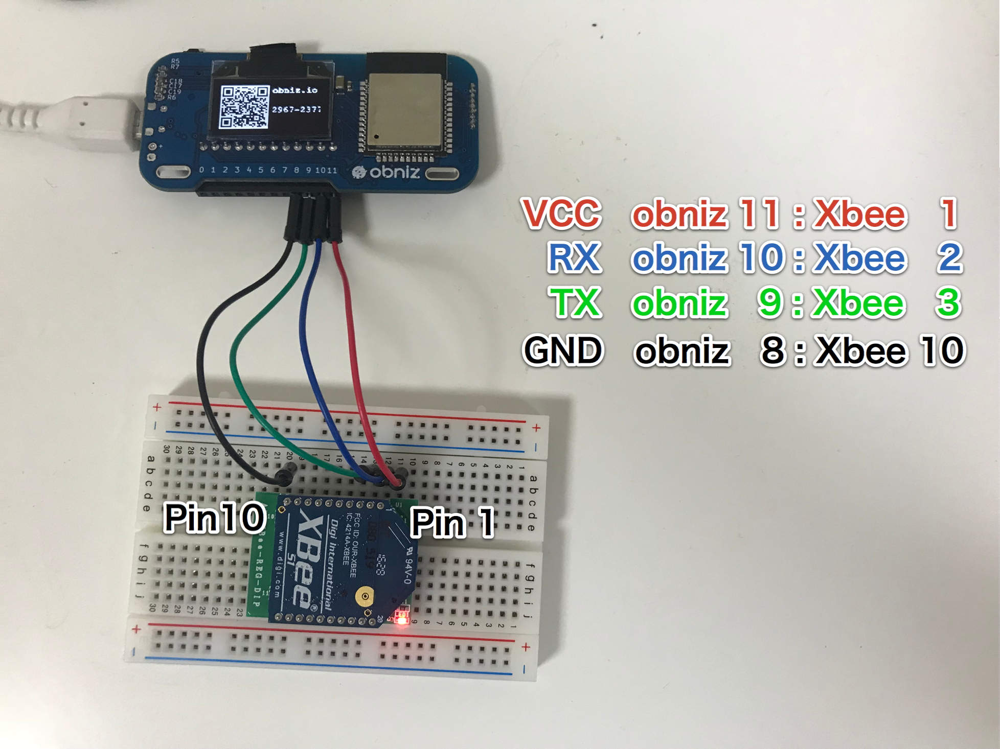

# XBee
Zigbeeネットワークで通信します．
復数のXBeeを使ってブロードキャストや１対１の通信ができます

## wired(obniz, tx_to_XBee, rx_from_XBee)

XBeeをtx,rxのピンを指定して接続します．
XBeeはVCCとGNDが必要なので，それは別で用意する必要があります．

この画像のように配線したのであれば，下のように書きます．

```
obniz.io11.output(true);
obniz.io8.output(false);
   
obniz.wired("XBee",9,10);
```


## await configWait(json)

 This function need some seconds (about 3sec).
So use with "await". 
If you have enough time until send something, it's not necessary.
```
await xbee.configWait({
   	"destination_address" : "52",
   	"source_address" : "51",
});
```

Json scheme is here.

``
{
  "destination_address" : "5A",     // hex string address send to  ( 0 ~ FFFFFFFFFFFFFFFF)
                                    // 0x000000000000FFFF is bloadcasting
  "source_address" : "E2",          // hex string address for mine ( 0 ~ FFFFFFFF)

  // or 

  "destination_address_high" : "0",  // higher 16 bit ( 0 ~ FFFFFFFF)
  "destination_address_low" : "5A",  // lower 16 bit ( 0 ~ FFFFFFFF)

  // or 

  "DH" : "0",                //AT command directly are supported.
  "DL" : "5A",               //see maker datasheets. 
  "MY" : "E2",
  
}
```

## send(data)
send a data.
available formats are

- string
- number => will be one byte data
- array of number => array of bytes
- object => converted to json string
- Buffer => array of bytes


If seting config are not finished, throw error. 
```
// Example
xbee.send("Hi");
xbee.send(0x11);
xbee.send([0x11, 0x45, 0x44]);
xbee.send({success: true});
```

## onreceive(data, text)

callback function when data recieved.
data is array of bytes.
text is same data. but it was text representation.

```
xbee.onreceive = function(data, text) {
    console.log("recieved : " + text);
}
```