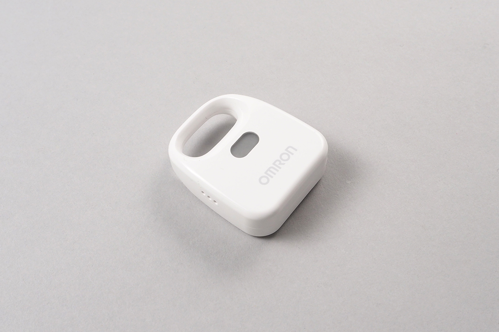

# 2JCIE
OMRON社製の環境センサです。電池で動作し、温度、湿度、照度、UV、気圧、騒音、加速度、VOCを計測できます。



## isDevice(BleRemotePeripheral)

デバイスを発見した場合、trueを返します。

```javascript
// Javascript Example
const Device = Obniz.getPartsClass('2JCIE');
await obniz.ble.initWait();
obniz.ble.scan.onfind = (p) => {
    if (Device.isDevice(p)) {
        let data = Device.getData(p);
        console.log(data);
    }
};
await obniz.ble.scan.startWait();
```

## getData(BleRemotePeripheral)

advertisementからデータを取得(そのようにモード設定されたデバイスのみ発信しています)
デバイスの種類により取得できる値が異なります。デバイスの設定でも変更が可能です。

2JCIE-BU01(バッグ形状)の`IM`というlocalNameを持つadvertisementの場合

- temperature: 温度(degC)
- relative_humidity: 湿度(%RH)
- light: 照度(lx)
- uv_index: 紫外線強度
- barometric_pressure: 気圧(hPa)
- soud_noise: 騒音(dB)
- acceleration_x: 加速度
- acceleration_y: 加速度
- acceleration_z: 加速度
- battery: バッテリー電圧(V)

2JCIE-BL01(USB接続)の`Rbt`というlocalNameを持つadvertisementの場合

- temperature: 温度(degC)
- relative_humidity: 湿度(%RH)
- light: 照度(lx)
- barometric_pressure: 気圧(hPa)
- soud_noise: 騒音(dB)
- etvoc: eTVOC(ppb)
- eco2: 等価CO2濃度(ppm)


```javascript
// Javascript Example
const Device = Obniz.getPartsClass('2JCIE');
await obniz.ble.initWait();
obniz.ble.scan.onfind = (p) => {
    if (Device.isDevice(p)) {
        let data = Device.getData(p);
        console.log(data);
    }
};
await obniz.ble.scan.startWait();
```

```javascript
// Example of "Rbt" pakcet
{
    barometric_pressure: 1015.755
    eco2: 719
    etvoc: 48
    light: 241
    relative_humidity: 30.46
    soud_noise: 77.52
    temperature: 24.16
}
```


## [await] findWait()

2JCIEを検索し、obniz.ble.peripheralオブジェクトを返します。
見つからずタイムアウトする場合はnullが返ります

```javascript
// Javascript Example
let omron = obniz.wired('2JCIE');
let results = await omron.findWait();

if(results){
  console.log("find");
}else{
  console.log("not find");
}
```

## connectWait()
センサに接続します。
自動的にデバイスを検索しますが、見つからなかった場合はエラーをthrowします

```javascript
// Javascript Example
let omron = obniz.wired('2JCIE');
let results = await omron.findWait();

if(results){
    console.log("find");
  
    omron.ondisconnect = (reason) => {
      console.log('disconnected');
    }
    await omron.connectWait();
    let data = await omron.getLatestData();
    
    console.log(data);
}else{
    console.log("not find");
}
```


## [await]disconnectWait()
センサから切断します

```javascript
// Javascript Example
let omron = obniz.wired('2JCIE');
let results = await omron.findWait();

if(results){
    console.log("find");
  
    await omron.connectWait();
    let data = await omron.getLatestData();
    
    console.log(data);
    
    await omron.disconnectWait();
}else{
    console.log("not find");
}

```


## [await]getLatestData()
最新のデータを取得します

```javascript
// Javascript Example

let omron = obniz.wired('2JCIE');
let results = await omron.findWait();

if(results){
    console.log("find");
  
    await omron.connectWait();
    let data = await omron.getLatestData();
    
    console.log(data);
    
    await omron.disconnectWait();
}else{
    console.log("not find");
}

```

返り値のフォーマットと単位は下記のとおりです
```javascript

//example response
{
  row_number: 0,
  temperature: 22.91,   //degC
  relative_humidity: 46.46, //%RH
  light: 75, //lx
  uv_index: 0.02, 
  barometric_pressure: 1010.4000000000001, // hPa
  soud_noise: 39.42, //dB
  discomfort_index: 68.75,  
  heatstroke_risk_factor: 19,  //degC
  battery_voltage: 30.12  // V
}

```
