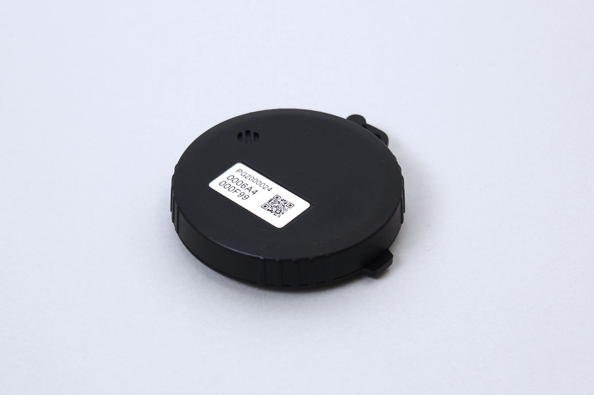

# BST_01A
This is a temperature, humidity sensor.



It starts sending data 20 secdonds after power up.
Advertisements every 2 seconds.
1.5 year battery life time.


## isDevice(peripheral)

Based on the advertisement information received by the BLE, it is determined whether it is.

```javascript
// Javascript Example
await obniz.ble.initWait();
const BST_01A = Obniz.getPartsClass("BST_01A");
obniz.ble.scan.onfind = async (peripheral) => {
  if (BST_01A.isDevice(peripheral)) {
    console.log("device found");
  }
};
await obniz.ble.scan.startWait();

```


## getData()

Acquires temperature, humidity based on the advertisement information received by the BLE.

```javascript
// Javascript Example
await obniz.ble.initWait();
const BST_01A = Obniz.getPartsClass("BST_01A")
obniz.ble.scan.onfind = (peripheral) => {
  if (BST_01A.isDevice(peripheral)) {
    console.log(BST_01A.getData(peripheral)) 
  }
};
await obniz.ble.scan.startWait();
```

The format of the return value is as follows.
327.67 degree or 327.67% is a error.

```javascript
{
  id: string
  battery: number;
  temperature: number;
  humidity: number;
}
```

