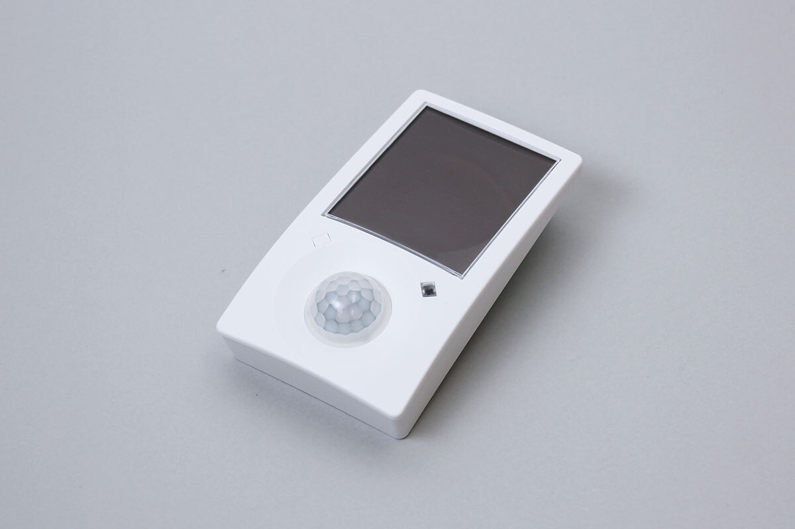

# EMDCB
EMDCBはBLEを使用した人感センサおよび照度センサです。  
天井等に取り付け、室内の光量、人の出入りを測定できます。  



## isDevice(peripheral)
BLEでスキャンしたperipheralがEMDCBかどうかを判定します。  

```javascript
// Javascript Example
await obniz.ble.initWait();
const EMDCB = Obniz.getPartsClass("EMDCB");
obniz.ble.scan.onfind = async (peripheral) => {
  if (EMDCB.isDevice(peripheral)) {
    console.log("device find");
    console.log(peripheral);
  }
};
await obniz.ble.scan.startWait();
```


## getData()
アドバタイズ情報を解析し、データを取得します。
```javascript
// Javascript Example
await obniz.ble.initWait();
const EMDCB = Obniz.getPartsClass("EMDCB");
obniz.ble.scan.onfind = async (peripheral) => {
  if (EMDCB.isDevice(peripheral)) {
    const result = EMDCB.getData(peripheral);
    console.log(result)
  }
};
await obniz.ble.scan.startWait();

```

### データフォーマット
```
{
  address: string;
  energy_level?: number; //電池残量(%)
  light_level_solar_cell?: number; //太陽電池の光量(lx)
  light_level_sensor?: number; //センサーの光量(lx)
  occupancy_status?: boolean; //人がいるかどうか
  commissioning_info?: number[]; //AES key & device address(22byte)
}
```
