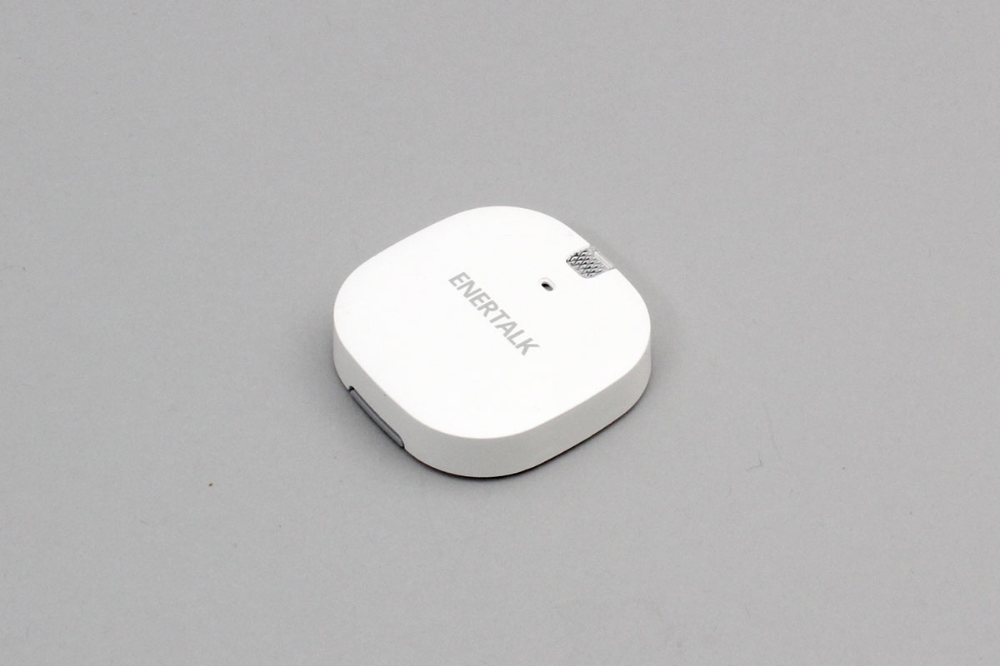

# ENERTALK_TOUCH
BLE Multi sensor made by Encoard Techonologies Inc.

- Temperature
- Humidity
- Lux
- Acceleration (3 dim)



## isDevice(peripheral)

Check whether it is ENERTALK_TOUCH based on the advertisement information

```javascript
// Javascript Example
await obniz.ble.initWait();
const ENERTALK_TOUCH = Obniz.getPartsClass("ENERTALK_TOUCH");
obniz.ble.scan.onfind = async (peripheral) => {
  if (ENERTALK_TOUCH.isDevice(peripheral)) {
    console.log("find");
  
  }
};
await obniz.ble.scan.startWait();

```

## new ENERTALK_TOUCH(peripheral)

Create an instance based on the advertisement information.

```javascript
// Javascript Example
await obniz.ble.initWait();
const ENERTALK_TOUCH = Obniz.getPartsClass("ENERTALK_TOUCH");
obniz.ble.scan.onfind = async (peripheral) => {
  if (ENERTALK_TOUCH.isDevice(peripheral)) {
    console.log("find");
    const device = new ENERTALK_TOUCH(peripheral);
  }
};
await obniz.ble.scan.startWait();


```


## [await]connectWait()

Connect to device.


```javascript
// Javascript Example
await obniz.ble.initWait();
const ENERTALK_TOUCH = Obniz.getPartsClass("ENERTALK_TOUCH");
obniz.ble.scan.onfind = async (peripheral) => {
  if (ENERTALK_TOUCH.isDevice(peripheral)) {
    console.log("find");
    const device = new ENERTALK_TOUCH(peripheral);
    device.ondisconnect = (reason) => {
      console.log(reason)
    }
    await device.connectWait();
    console.log("connected");
  }
};
await obniz.ble.scan.startWait();


```


## [await]disconnectWait()

Disconnect from device.

```javascript
// Javascript Example
await obniz.ble.initWait();
const ENERTALK_TOUCH = Obniz.getPartsClass("ENERTALK_TOUCH");
obniz.ble.scan.onfind = async (peripheral) => {
  if (ENERTALK_TOUCH.isDevice(peripheral)) {
    console.log("find");
    const device = new ENERTALK_TOUCH(peripheral);
    await device.connectWait();
    console.log("connected");
    await device.disconnectWait();
    console.log("disconnected");
  }
};
await obniz.ble.scan.startWait();

```


## getTemperatureWait()

Get temperature value.


```javascript

// Javascript Example
await obniz.ble.initWait();
const ENERTALK_TOUCH = Obniz.getPartsClass("ENERTALK_TOUCH");
obniz.ble.scan.onfind = async (peripheral) => {
  if (ENERTALK_TOUCH.isDevice(peripheral)) {
    console.log("find");
    const device = new ENERTALK_TOUCH(peripheral);
    await device.connectWait();
    console.log("connected");
    const temperature = await device.getTemperatureWait();
    console.log(temperature);
  }
};
await obniz.ble.scan.startWait();

```

## getHumidityWait()

Get humidity value.


```javascript

// Javascript Example
await obniz.ble.initWait();
const ENERTALK_TOUCH = Obniz.getPartsClass("ENERTALK_TOUCH");
obniz.ble.scan.onfind = async (peripheral) => {
  if (ENERTALK_TOUCH.isDevice(peripheral)) {
    console.log("find");
    const device = new ENERTALK_TOUCH(peripheral);
    await device.connectWait();
    console.log("connected");
    const humid = await device.getHumidityWait();
    console.log(humid);
  }
};
await obniz.ble.scan.startWait();

```


## getIlluminationWait()
Get illumination value.


```javascript

// Javascript Example
await obniz.ble.initWait();
const ENERTALK_TOUCH = Obniz.getPartsClass("ENERTALK_TOUCH");
obniz.ble.scan.onfind = async (peripheral) => {
  if (ENERTALK_TOUCH.isDevice(peripheral)) {
    console.log("find");
    const device = new ENERTALK_TOUCH(peripheral);
    await device.connectWait();
    console.log("connected");
    const lux = await device.getIlluminationWait();
    console.log(lux);
  }
};
await obniz.ble.scan.startWait();

```


## getAccelerometerWait()

Get accelerometer value.

```javascript

// Javascript Example
await obniz.ble.initWait();
const ENERTALK_TOUCH = Obniz.getPartsClass("ENERTALK_TOUCH");
obniz.ble.scan.onfind = async (peripheral) => {
  if (ENERTALK_TOUCH.isDevice(peripheral)) {
    console.log("find");
    const device = new ENERTALK_TOUCH(peripheral);
    await device.connectWait();
    console.log("connected");
    const accel = await device.getAccelerometerWait();
    console.log(accel.x, accel.y, accel.z );
  }
};
await obniz.ble.scan.startWait();
```


## [await]batteryService.getBatteryLevelWait()

バッテリー残量を取得します。電池残量に応じて0-100[%]が返ります


```javascript
// Javascript Example
await obniz.ble.initWait();
const ENERTALK_TOUCH = Obniz.getPartsClass("ENERTALK_TOUCH");
obniz.ble.scan.onfind = async (peripheral) => {
  if (ENERTALK_TOUCH.isDevice(peripheral)) {
    console.log("find");
    const device = new ENERTALK_TOUCH(peripheral);
    await device.connectWait();
    console.log("connected");
    const batteryLevel = await device.batteryService.getBatteryLevelWait();
    console.log(`batteryLevel ${batteryLevel}% `);

  }
};
await obniz.ble.scan.startWait();
```

