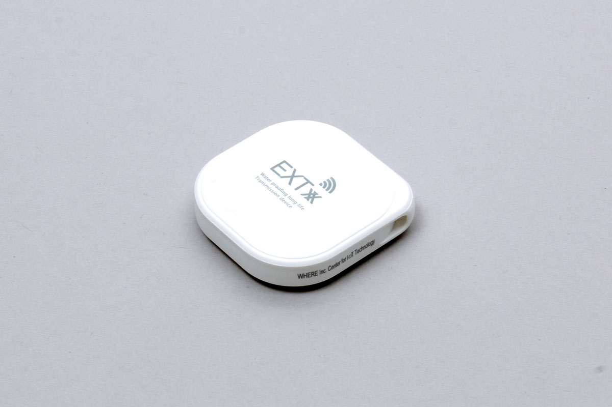

# EXTxx

Beacon for BLE communication made by WHERE



## Data acquisition

- uuid: iBeacon uuid
- major: iBeacon major
- minor: iBeacon minor
- power: iBeacon power
- battery: Battery level

```javascript
// Javascript Example
const EXTxx = Obniz.getPartsClass('EXTxx');
await obniz.ble.initWait();
obniz.ble.scan.onfind = (p) => {
    if (EXTxx.isDevice(p)) {
        const device = new EXTxx(p);
        const data = device.getData();
        console.log(data);
    }
};
await obniz.ble.scan.startWait(null, { duplicate: true, duration: null });
```

or

```javascript
// Javascript Example
const EXTxx = Obniz.getPartsClass('EXTxx');
await obniz.ble.initWait();
obniz.ble.scan.onfind = (p) => {
    if (EXTxx.isDevice(p)) {
        const data = EXTxx.getData(p);
        console.log(data);
    }
};
await obniz.ble.scan.startWait(null, { duplicate: true, duration: null });
```
