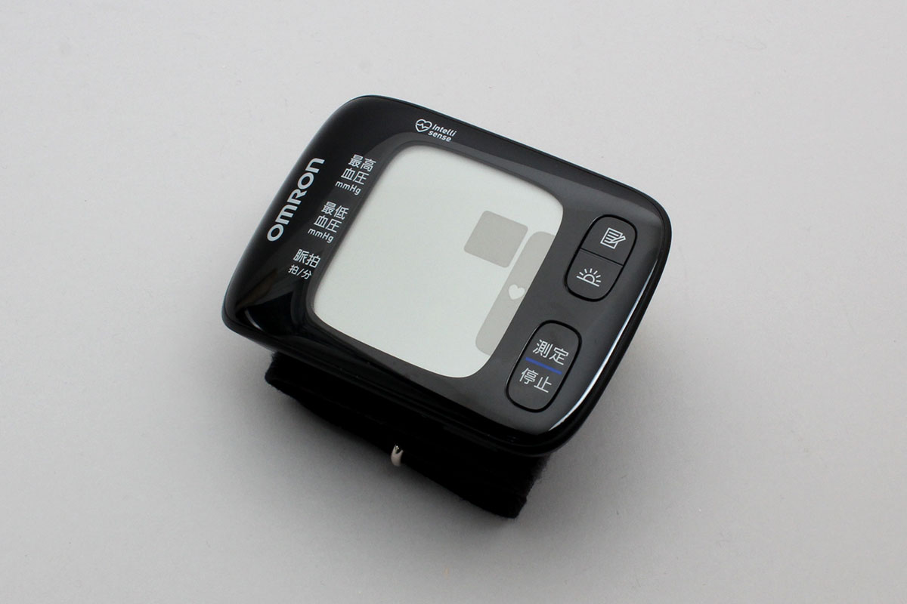

# HEM_6233T
This is a blood pressure sensor from OMRON Corporation.


## isDevice(peripheral)

Judges whether or not it is HEM_6233T based on the advertised information received by the BLE.
```javascript
// Javascript Example
await obniz.ble.initWait();
const HEM_6233T = Obniz.getPartsClass("HEM_6233T");
obniz.ble.scan.onfind = async (peripheral) => {
  if (HEM_6233T.isDevice(peripheral)) {
    console.log("device find");
  }
};
await obniz.ble.scan.startWait();

```

## new HEM_6233T(peripheral, timezoneOffsetMinute)

Instances are created based on the advertised information received by the BLE.

```javascript
// Javascript Example
await obniz.ble.initWait();
const HEM_6233T = Obniz.getPartsClass("HEM_6233T");
obniz.ble.scan.onfind = async (peripheral) => {
  if (HEM_6233T.isDevice(peripheral) ) {
    console.log("device find");
    const device = new HEM_6233T(peripheral, 9*60);
  }
};
await obniz.ble.scan.startWait();

```


## [await]getDataWait()

Connects to the device and collects data in batches.
The only data that can be retrieved is the data that the device has not yet sent.

After the data is sent, the connection to the device is automatically terminated.


```javascript
// Javascript Example
await obniz.ble.initWait();
const HEM_6233T = Obniz.getPartsClass("HEM_6233T");
obniz.ble.scan.onfind = async (peripheral) => {
  if (HEM_6233T.isDevice(peripheral)) {
    console.log("find");
    const device = new HEM_6233T(peripheral,9*60);
    
    const data = await device.getDataWait();
    
    console.log(data);
   
  }
};
await obniz.ble.scan.startWait();

```


Output format is here. 

```json
{
  bloodPressure?: {
    systolic: number;
    diastolic: number;
    meanArterialPressure: number;
    unit: "mmHg";
  };
  date?: {
    year: number;
    month: number;
    day: number;
    hour: number;
    minute: number;
    second: number;
  };
  pulseRate?: number;
  userId?: number;
  measurementStatus?: HEM_6233TMesurementStatus[];
}
```
