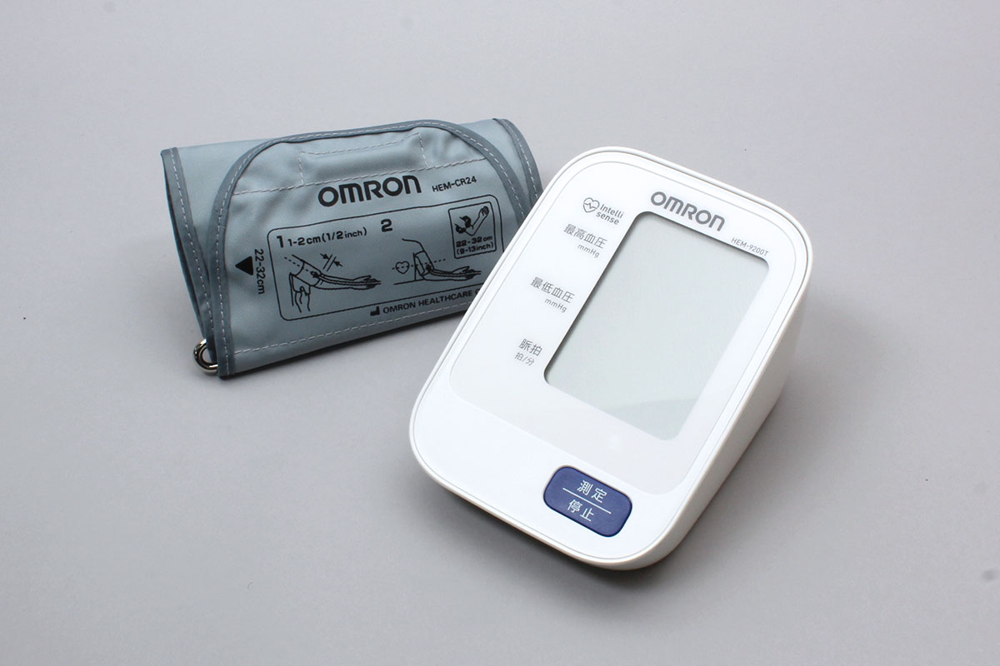

# HEM_9200T
オムロン株式会社の血圧計です。


## isDevice(peripheral)

BLEで受信したアドバタイズ情報をもとに、HEM_9200Tかどうかを判定します

```javascript
// Javascript Example
await obniz.ble.initWait();
const HEM_9200T = Obniz.getPartsClass("HEM_9200T");
obniz.ble.scan.onfind = async (peripheral) => {
  if (HEM_9200T.isDevice(peripheral)) {
    console.log("device find");
  }
};
await obniz.ble.scan.startWait();

```

## new HEM_9200T(peripheral, {timezoneOffsetMinute, passkey})

BLEで受信したアドバタイズ情報をもとに、インスタンスを作成します。

```javascript
// Javascript Example
await obniz.ble.initWait();
const HEM_9200T = Obniz.getPartsClass("HEM_9200T");
obniz.ble.scan.onfind = async (peripheral) => {
  if (HEM_9200T.isDevice(peripheral) ) {
    console.log("device find");
    const device = new HEM_9200T(peripheral, {timezoneOffsetMinute: 9*60, passkey: 208729 });
  }
};
await obniz.ble.scan.startWait();


```


## [await]getDataWait()

デバイスに接続し、データを一括取得します。
取得できるデータはデバイスが未送信のデータのみです

データ送信後、自動的にデバイスとの接続が切断されます。

```javascript
// Javascript Example
await obniz.ble.initWait();
const HEM_9200T = Obniz.getPartsClass("HEM_9200T");
obniz.ble.scan.onfind = async (peripheral) => {
  if (HEM_9200T.isDevice(peripheral)) {
    console.log("find");
    const device = new HEM_9200T(peripheral,{timezoneOffsetMinute: 9*60, passkey: 208729 });
    
    const data = await device.getDataWait();
    
    console.log(data);
   
  }
};
await obniz.ble.scan.startWait();
```


データフォーマットは次の通りで、celsius　もしくは fahrenheit に温度データが入っています。

```json
 {
  bloodPressure?: {
    systolic: number;
    diastolic: number;
    meanArterialPressure: number;
    unit: "mmHg";
  };
  date?: {
    year: number;
    month: number;
    day: number;
    hour: number;
    minute: number;
    second: number;
  };
  pulseRate?: number;
  userId?: number;
  measurementStatus?: HEM_9200TMesurementStatus[];
}
```
