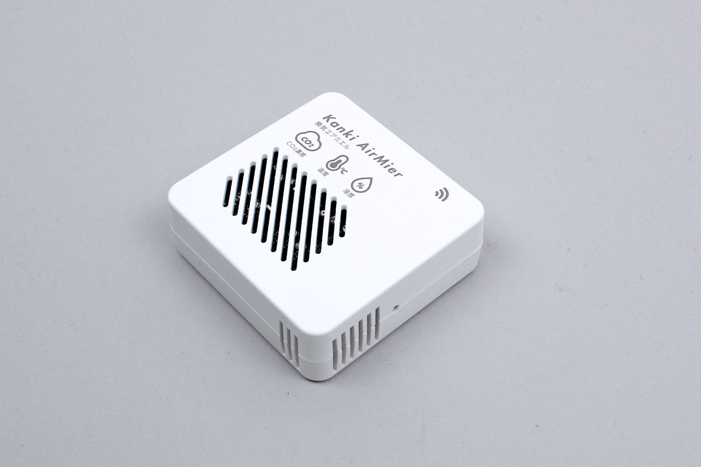

# KankiAirMier


Co2 environmental sensor with BLE communication manufactured by Step One.



## getData


Get the data being advertised.


- co2: carbon dioxide concentration \[ppm]
- temperature : temperature \[degrees]
- humidity: Humidity \[%RH]
- sequenceNumber: sequence number. The number is counted each time it is re-measured
- deviceName: Device name


```javascript
// Javascript Example
const airMier = Obniz.getPartsClass('KankiAirMier');
await obniz.ble.initWait();
obniz.ble.scan.onfind = (p) => {
    if (airMier.isDevice(p)) {
        const data = airMier.getData(p);
        console.log(data);
    }
};
await obniz.ble.scan.startWait(null, { duplicate: true, duration: null });
```
