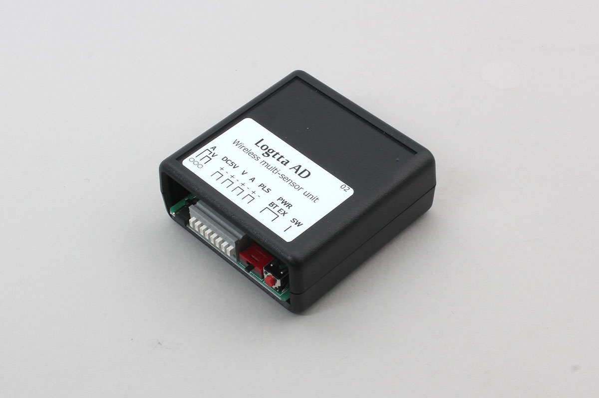

# Logtta AD

BLE connectable AD Converter.




## isDevice(BleRemotePeripheral)

Returns true if a device was found.

```javascript
// Javascript Example
const LOGTTA_AD = Obniz.getPartsClass('Logtta_AD');
await obniz.ble.initWait();
obniz.ble.scan.onfind = (p) => {
    if (LOGTTA_AD.isDevice(p)) {
        let data = LOGTTA_AD.getData(p);
        console.log(data);
    }
};
await obniz.ble.scan.startWait(null, { duplicate: true, duration: null });
```

## new LOGTTA_AD(peripheral)

Create an instance based on the advertisement information received by BLE.

```javascript
// Javascript Example
const LOGTTA_AD = Obniz.getPartsClass('Logtta_AD');
await obniz.ble.initWait();
obniz.ble.scan.onfind = async (peripheral) => {
  if (LOGTTA_AD.isDevice(peripheral) ) {
    console.log("device find");
    const device = new LOGTTA_AD(peripheral);
  }
};
await obniz.ble.scan.startWait();

```


## [await]connectWait()

Connect to the device.

```javascript
// Javascript Example
const LOGTTA_AD = Obniz.getPartsClass('Logtta_AD');
await obniz.ble.initWait();
obniz.ble.scan.onfind = async (peripheral) => {
  if (LOGTTA_AD.isDevice(peripheral)) {
    console.log("find");
    const device = new LOGTTA_AD(peripheral);
    device.ondisconnect = (reason) => {
      console.log(reason)
    }
    await device.connectWait();
    console.log("connected");
  }
};
await obniz.ble.scan.startWait();

```


## [await]disconnectWait()

Disonnect to the device.

```javascript
// Javascript Example
const LOGTTA_AD = Obniz.getPartsClass('Logtta_AD');
await obniz.ble.initWait();
obniz.ble.scan.onfind = async (peripheral) => {
  if (LOGTTA_AD.isDevice(peripheral) ) {
    console.log("find");
    const device = new LOGTTA_AD(peripheral);
    await device.connectWait();
    console.log("connected");
    await device.disconnectWait();
    console.log("disconnected");
  }
};
await obniz.ble.scan.startWait();

```


## onNotify =  function (data){}

When data is received, return the data in a callback function.

Called every time data comes from the device after starting `` startNotifyWait () ``.

```javascript
// Javascript Example
const LOGTTA_AD = Obniz.getPartsClass('Logtta_AD');
await obniz.ble.initWait();
obniz.ble.scan.onfind = async (peripheral) => {
  if (LOGTTA_AD.isDevice(peripheral)) {
    console.log("find");
    const device = new LOGTTA_AD(peripheral);
    await device.connectWait();
    console.log("connected");
    device.onNotify = (data) => {
        console.log( `ampere:${data.ampere} volt:${data.volt} count:${data.count}` );
    };
    device.startNotifyWait();
  }
};
await obniz.ble.scan.startWait();
```

## startNotifyWait()

Instructs to start sending sensor data.

```javascript
// Javascript Example
const LOGTTA_AD = Obniz.getPartsClass('Logtta_AD');
await obniz.ble.initWait();
obniz.ble.scan.onfind = async (peripheral) => {
  if (LOGTTA_AD.isDevice(peripheral)) {
    console.log("find");
    const device = new LOGTTA_AD(peripheral);
    await device.connectWait();
    console.log("connected");
    device.onNotify = (data) => {
        console.log( `ampere:${data.ampere} volt:${data.volt} count:${data.count}` );
    };
    device.startNotifyWait();
  }
};
await obniz.ble.scan.startWait();
```


## [await]getAllWait()
Get All Data from device.

```javascript
// Javascript Example
const LOGTTA_AD = Obniz.getPartsClass('Logtta_AD');
await obniz.ble.initWait();
obniz.ble.scan.onfind = async (peripheral) => {
  if (LOGTTA_AD.isDevice(peripheral)) {
    console.log("find");
    const device = new LOGTTA_AD(peripheral);
    await device.connectWait();
    console.log("connected");
    
    const data = await device.getAllWait();
    console.log(`AD get volt ${data.volt} or ampere ${data.ampere} count ${data.count}`);
  }
};
await obniz.ble.scan.startWait();
```


The format is below.
```json
// example response
{
  "ampere": 5, // mA
  "volt": 3,   // mV
  "count": 10  // count
}
```

## [await]getAmpereWait()
Get Ampere Data from device.

```javascript
// Javascript Example
const LOGTTA_AD = Obniz.getPartsClass('Logtta_AD');
await obniz.ble.initWait();
obniz.ble.scan.onfind = async (peripheral) => {
  if (LOGTTA_AD.isDevice(peripheral)) {
    console.log("find");
    const device = new LOGTTA_AD(peripheral);
    await device.connectWait();
    console.log("connected");
    
    const data = await device.getAmpereWait();
    console.log(`AD data ${data}`);
  }
};
await obniz.ble.scan.startWait();
```


## [await]getVoltWait()
Get Volt Data from device.

```javascript
// Javascript Example
const LOGTTA_AD = Obniz.getPartsClass('Logtta_AD');
await obniz.ble.initWait();
obniz.ble.scan.onfind = async (peripheral) => {
  if (LOGTTA_AD.isDevice(peripheral)) {
    console.log("find");
    const device = new LOGTTA_AD(peripheral);
    await device.connectWait();
    console.log("connected");
    
    const data = await device.getVoltWait();
    console.log(`AD data ${data}`);
  }
};
await obniz.ble.scan.startWait();
```


## [await]getCountWait()
Get count Data from device.

```javascript
// Javascript Example
const LOGTTA_AD = Obniz.getPartsClass('Logtta_AD');
await obniz.ble.initWait();
obniz.ble.scan.onfind = async (peripheral) => {
  if (LOGTTA_AD.isDevice(peripheral)) {
    console.log("find");
    const device = new LOGTTA_AD(peripheral);
    await device.connectWait();
    console.log("connected");
    
    const data = await device.getCountWait();
    console.log(`AD data ${data}`);
  }
};
await obniz.ble.scan.startWait();
```
