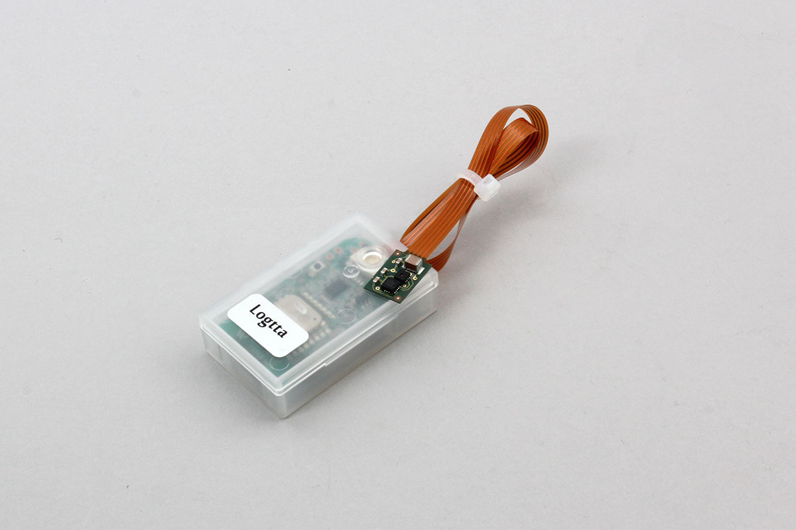

# Logtta Accel

This device advertise acceleration sensor values.

http://www.uni-elec.co.jp/logtta_accel_3_0_torisetsu.pdf

This library operates in the beacon mode referring to the above document.

Search Logtta Accel and get the data.




## getPartsClass(name)

```javascript
// Javascript Example
const LOGTTA = Obniz.getPartsClass('Logtta_Accel');
```

## isDevice(BleRemotePeripheral)

Returns true if a device was found.

```javascript
// Javascript Example
const LOGTTA = Obniz.getPartsClass('Logtta_Accel');
await obniz.ble.initWait();
obniz.ble.scan.onfind = (p) => {
    if (LOGTTA.isDevice(p)) {
        let data = LOGTTA.getScanData(p);
        console.log(data);
    }
};
await obniz.ble.scan.startWait(null, { duplicate: true, duration: null });
```

## getScanData(BleRemotePeripheral)

Returns device information if found. Returns Null if not found.

- battery : Battery voltage
- sequence : Sequence number
- revision : module version
- name : Module name
- setting
    - temp_cycle : Temperature and humidity measurement cycle (seconds)
    - accel_sampling : acceleration sampling frequency (Hz)
    - hpf : High pass filter
    - accel_range : acceleration range (G)
    - accel_axis : acceleration measurement axis (0b001: Z, 0b010: Y, 0b011: Y / Z, 0b100: X, 0b101: X / Z, 0b110: X / Y, 0b111: X / Y / Z)
    - accel_resolution : acceleration resolution (bit)
- temperature: temperature
- humidity: Humidity
- alert: Alert status of the last four alerts

```javascript
// Javascript Example
const LOGTTA = Obniz.getPartsClass('Logtta_Accel');
await obniz.ble.initWait();
obniz.ble.scan.onfind = (p) => {
    if (LOGTTA.isDevice(p)) {
        let data = LOGTTA.getScanData(p);
        console.log(data);
    }
};
await obniz.ble.scan.startWait(null, { duplicate: true, duration: null });
```

## getAccelData(BleRemotePeripheral)

Returns device information if found. Returns Null if not found.

- peak : Acceleration peak data
- rms : Acceleration RMS data

```javascript
// Javascript Example
const LOGTTA = Obniz.getPartsClass('Logtta_Accel');
await obniz.ble.initWait();
obniz.ble.scan.onfind = (p) => {
    if (LOGTTA.isDevice(p)) {
        let data = LOGTTA.getAccelData(p);
        console.log(data);
    }
};
await obniz.ble.scan.startWait(null, { duplicate: true, duration: null });
```
