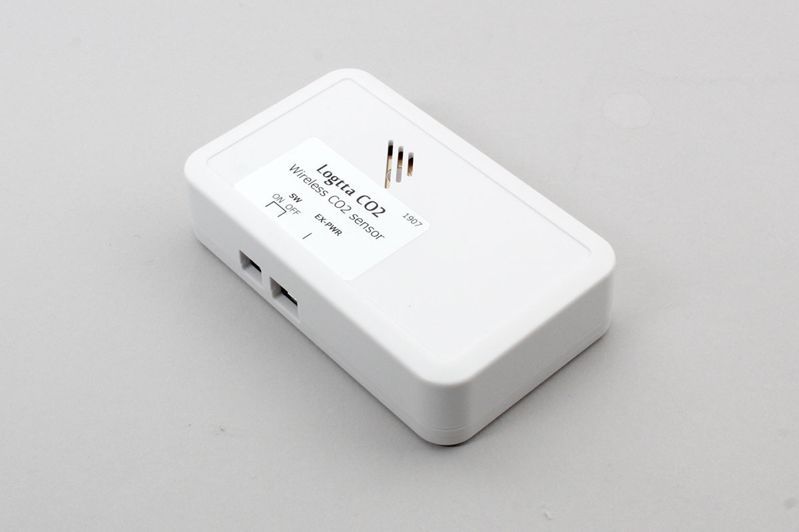

# Logtta CO2

Logtta CO2 を使用できます。

CO2濃度を取得できます。




## getPartsClass(name)

```javascript
// Javascript Example
const LOGTTA_CO2 = Obniz.getPartsClass('Logtta_CO2');
```

## isDevice(BleRemotePeripheral)

デバイスを発見した場合、trueを返します。

```javascript
// Javascript Example
const LOGTTA_CO2 = Obniz.getPartsClass('Logtta_CO2');
await obniz.ble.initWait();
obniz.ble.scan.onfind = (p) => {
    if (LOGTTA_CO2.isDevice(p)) {
        console.log("find");
    }
};
await obniz.ble.scan.startWait(null, { duplicate: true, duration: null });
```

## new Logtta_CO2(peripheral)

BLEが受信した広告情報に基づいてインスタンスを作成します。


```javascript
// Javascript Example
const LOGTTA_CO2 = Obniz.getPartsClass('Logtta_CO2');
await obniz.ble.initWait();
obniz.ble.scan.onfind = async (peripheral) => {
  if (LOGTTA_CO2.isDevice(peripheral) ) {
    console.log("device find");
    const device = new LOGTTA_CO2(peripheral);
  }
};
await obniz.ble.scan.startWait();

```


## [await]connectWait()

デバイスに接続します。


```javascript
// Javascript Example
const LOGTTA_CO2 = Obniz.getPartsClass('Logtta_CO2');
await obniz.ble.initWait();
obniz.ble.scan.onfind = async (peripheral) => {
  if (LOGTTA_CO2.isDevice(peripheral)) {
    console.log("find");
    const device = new LOGTTA_CO2(peripheral);
    device.ondisconnect = (reason) => {
      console.log(reason)
    }
    await device.connectWait();
    console.log("connected");
  }
};
await obniz.ble.scan.startWait();

```


## [await]disconnectWait()

デバイスとの接続を切断します。

```javascript
// Javascript Example
const LOGTTA_CO2 = Obniz.getPartsClass('Logtta_CO2');
await obniz.ble.initWait();
obniz.ble.scan.onfind = async (peripheral) => {
  if (LOGTTA_CO2.isDevice(peripheral) ) {
    console.log("find");
    const device = new LOGTTA_CO2(peripheral);
    await device.connectWait();
    console.log("connected");
    await device.disconnectWait();
    console.log("disconnected");
  }
};
await obniz.ble.scan.startWait();

```


## onNotify =  function (data){}

データを受信したら、そのデータをコールバック関数で返します。

``startNotifyWait()``を開始した後にデバイスからデータが来るたびに呼び出されます。

```javascript
// Javascript Example
const LOGTTA_CO2 = Obniz.getPartsClass('Logtta_CO2');
await obniz.ble.initWait();
obniz.ble.scan.onfind = async (peripheral) => {
  if (LOGTTA_CO2.isDevice(peripheral)) {
    console.log("find");
    const device = new LOGTTA_CO2(peripheral);
    await device.connectWait();
    console.log("connected");
        device.onNotify = (co2) => {
            console.log(`CO2 ${co2}ppm`);
        };
    device.startNotifyWait();
  }
};
await obniz.ble.scan.startWait();
```

## startNotifyWait()

Notifyを開始します。

```javascript
// Javascript Example
const LOGTTA_CO2 = Obniz.getPartsClass('Logtta_CO2');
await obniz.ble.initWait();
obniz.ble.scan.onfind = async (peripheral) => {
  if (LOGTTA_CO2.isDevice(peripheral)) {
    console.log("find");
    const device = new LOGTTA_CO2(peripheral);
    await device.connectWait();
    console.log("connected");
    device.onNotify = (co2) => {
        console.log(`CO2 ${co2}ppm`);
    };
    device.startNotifyWait();
  }
};
await obniz.ble.scan.startWait();
```


## [await]getWait()

CO2濃度を取得できます。

```javascript
// Javascript Example
const LOGTTA_CO2 = Obniz.getPartsClass('Logtta_CO2');
await obniz.ble.initWait();
obniz.ble.scan.onfind = async (peripheral) => {
  if (LOGTTA_CO2.isDevice(peripheral)) {
    console.log("find");
    const device = new LOGTTA_CO2(peripheral);
    await device.connectWait();
    console.log("connected");
    
    const co2 = await device.getWait();
    console.log(`CO2 ${co2}ppm`);
  }
};
await obniz.ble.scan.startWait();
```


## [await]batteryService.getBatteryLevelWait()

バッテリー残量を取得します。

- USB電源につながっている場合は254が返ります
- 電池駆動している場合は、残量に応じて0-100[%]が返ります


```javascript
// Javascript Example
const LOGTTA_CO2 = Obniz.getPartsClass('Logtta_CO2');
await obniz.ble.initWait();
obniz.ble.scan.onfind = async (peripheral) => {
  if (LOGTTA_CO2.isDevice(peripheral)) {
    console.log("find");
    const device = new LOGTTA_CO2(peripheral);
    await device.connectWait();
    console.log("connected");
    
    const batteryLevel = await device.batteryService.getBatteryLevelWait();
    console.log(`batteryLevel ${batteryLevel}% `);
  }
};
await obniz.ble.scan.startWait();
```

## [await]authPinCodeWait(pin)

デバイスと認証を行います。デフォルト値は0000です。

```javascript
// Javascript Example
const LOGTTA_CO2 = Obniz.getPartsClass('Logtta_CO2');
await obniz.ble.initWait();
obniz.ble.scan.onfind = async (peripheral) => {
  if (LOGTTA_CO2.isDevice(peripheral) ) {
    console.log("find");
    const device = new LOGTTA_CO2(peripheral);
    await device.connectWait();
    console.log("connected");
    await device.authPinCodeWait("0000");
    console.log("authPinCodeWait");
  }
};
await obniz.ble.scan.startWait();

```

## [await]setBeaconMode(enable)

デバイスと認証をあらかじめ済ませた状態で実行してください。

定期的にビーコンを発信するモードの有効無効を制御できます。

設定後に切断した後から有効になります。

ビーコンモードを終了する場合、デバイスにあるボタンを2秒以上長押しする操作が必要になります。詳しくは下記のリンクよりドキュメントをご覧ください。
http://www.uni-elec.co.jp/logtta_page.html

```javascript
// Javascript Example
const LOGTTA_CO2 = Obniz.getPartsClass('Logtta_CO2');
await obniz.ble.initWait();
obniz.ble.scan.onfind = async (peripheral) => {
  if (LOGTTA_CO2.isDevice(peripheral) ) {
    console.log("find");
    const device = new LOGTTA_CO2(peripheral);
    await device.connectWait();
    console.log("connected");
    await device.authPinCodeWait("0000");
    console.log("authPinCodeWait");
    await device.setBeaconMode(true);
    console.log("authPinCodeWait");
    await device.disconnectWait();
    console.log("disconnected");
  }
};
await obniz.ble.scan.startWait();

```


## isAdvDevice(BleRemotePeripheral)

アドバタイジングしているデバイスを発見した場合、trueを返します。

```javascript
// Javascript Example
const LOGTTA_CO2 = Obniz.getPartsClass('Logtta_CO2');
await obniz.ble.initWait();
obniz.ble.scan.onfind = (p) => {
    if (LOGTTA_CO2.isAdvDevice(p)) {
        console.log("found");
    }
};
await obniz.ble.scan.startWait(null, { duplicate: true, duration: null });

```

## getData(BleRemotePeripheral)

発見した場合にデバイスの情報を返します。発見できなかった場合にはNullを返します。

- battery : バッテリの電圧
- address : MacAddress
- co2 : co2濃度
- interval : 送信間隔


```javascript
// Javascript Example
const LOGTTA_CO2 = Obniz.getPartsClass('Logtta_CO2');
await obniz.ble.initWait();
obniz.ble.scan.onfind = (p) => {
    if (LOGTTA_CO2.isAdvDevice(p)) {
        let data = LOGTTA_CO2.getData(p);
        console.log(data);
    }
};
await obniz.ble.scan.startWait(null, { duplicate: true, duration: null });
```
