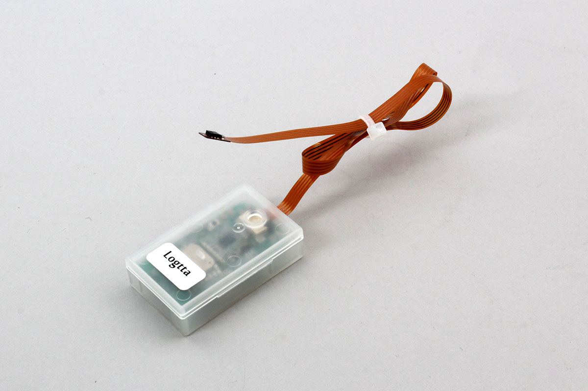

# Logtta TH

BLE Connectable Temperaterue Sensor




## getPartsClass(name)

```javascript
// Javascript Example
const Logtta_TH = Obniz.getPartsClass('Logtta_TH');
```

## isDevice(BleRemotePeripheral)

Returns true if a device was found.

```javascript
// Javascript Example
const Logtta_TH = Obniz.getPartsClass('Logtta_TH');
await obniz.ble.initWait();
obniz.ble.scan.onfind = (p) => {
    if (Logtta_TH.isDevice(p)) {
        console.log("find");
    }
};
await obniz.ble.scan.startWait(null, { duplicate: true, duration: null });
```

## new Logtta_TH(peripheral)

Create an instance based on the advertisement information received by BLE.

```javascript
// Javascript Example
const Logtta_TH = Obniz.getPartsClass('Logtta_TH');
await obniz.ble.initWait();
obniz.ble.scan.onfind = async (peripheral) => {
  if (Logtta_TH.isDevice(peripheral) ) {
    console.log("device find");
    const device = new Logtta_TH(peripheral);
  }
};
await obniz.ble.scan.startWait();

```


## [await]connectWait()

Connect to the device.

```javascript
// Javascript Example
const Logtta_TH = Obniz.getPartsClass('Logtta_TH');
await obniz.ble.initWait();
obniz.ble.scan.onfind = async (peripheral) => {
  if (Logtta_TH.isDevice(peripheral)) {
    console.log("find");
    const device = new Logtta_TH(peripheral);
    device.ondisconnect = (reason) => {
      console.log(reason)
    }
    await device.connectWait();
    console.log("connected");
  }
};
await obniz.ble.scan.startWait();
```


## [await]disconnectWait()

Disonnect to the device.

```javascript
// Javascript Example
const Logtta_TH = Obniz.getPartsClass('Logtta_TH');
await obniz.ble.initWait();
obniz.ble.scan.onfind = async (peripheral) => {
  if (Logtta_TH.isDevice(peripheral) ) {
    console.log("find");
    const device = new Logtta_TH(peripheral);
    await device.connectWait();
    console.log("connected");
    await device.disconnectWait();
    console.log("disconnected");
  }
};
await obniz.ble.scan.startWait();
```


## onNotify =  function (data){}

When data is received, return the data in a callback function.

Called every time data comes from the device after starting `` startNotifyWait () ``.

```javascript
// Javascript Example
const Logtta_TH = Obniz.getPartsClass('Logtta_TH');
await obniz.ble.initWait();
obniz.ble.scan.onfind = async (peripheral) => {
  if (Logtta_TH.isDevice(peripheral)) {
    console.log("find");
    const device = new Logtta_TH(peripheral);
    await device.connectWait();
    console.log("connected");
    device.onNotify = (data) => {
        console.log(`temperature ${data.temperature} humidity ${data.humidity}`);
    };
    device.startNotifyWait();
  }
};
await obniz.ble.scan.startWait();
```

## startNotifyWait()

Instructs to start sending sensor data.

```javascript
// Javascript Example
const Logtta_TH = Obniz.getPartsClass('Logtta_TH');
await obniz.ble.initWait();
obniz.ble.scan.onfind = async (peripheral) => {
  if (Logtta_TH.isDevice(peripheral)) {
    console.log("find");
    const device = new Logtta_TH(peripheral);
    await device.connectWait();
    console.log("connected");
    device.onNotify = (data) => {
        console.log(`temperature ${data.temperature} humidity ${data.humidity}`);
    };
    device.startNotifyWait();
  }
};
await obniz.ble.scan.startWait();
```


## [await]getAllWait()

Get All Data from device.

```javascript
// Javascript Example
const Logtta_TH = Obniz.getPartsClass('Logtta_TH');
await obniz.ble.initWait();
obniz.ble.scan.onfind = async (peripheral) => {
  if (Logtta_TH.isDevice(peripheral)) {
    console.log("find");
    const device = new Logtta_TH(peripheral);
    await device.connectWait();
    console.log("connected");
    
    const data = await device.getAllWait();
    console.log(`temperature ${data.temperature} humidity ${data.humidity}`);
  }
};
await obniz.ble.scan.startWait();
```

The format is below.

```json
// example response
{
  "temperature": 20,
  "humidity": 30, 
}
```

## [await]getTemperatureWait()

Get temperature Data from device.

```javascript
// Javascript Example
const LOGTTA_AD = Obniz.getPartsClass('Logtta_AD');
await obniz.ble.initWait();
obniz.ble.scan.onfind = async (peripheral) => {
  if (LOGTTA_AD.isDevice(peripheral)) {
    console.log("find");
    const device = new LOGTTA_AD(peripheral);
    await device.connectWait();
    console.log("connected");
    
    const temperature = await device.getTemperatureWait();
    console.log(`temperature ${temperature}`);
  }
};
await obniz.ble.scan.startWait();
```


## [await]getHumidityWait()

Get humidity Data from device.

```javascript
// Javascript Example
const LOGTTA_AD = Obniz.getPartsClass('Logtta_AD');
await obniz.ble.initWait();
obniz.ble.scan.onfind = async (peripheral) => {
  if (LOGTTA_AD.isDevice(peripheral)) {
    console.log("find");
    const device = new LOGTTA_AD(peripheral);
    await device.connectWait();
    console.log("connected");
    
    const humidity = await device.getHumidityWait();
    console.log(`humidity ${humidity}`);
  }
};
await obniz.ble.scan.startWait();
```


## [await]authPinCodeWait(pin)

Authenticate with the device. The default value is 0000.

```javascript
// Javascript Example
const Logtta_AD = Obniz.getPartsClass('Logtta_AD');
await obniz.ble.initWait();
obniz.ble.scan.onfind = async (peripheral) => {
  if (Logtta_AD.isDevice(peripheral) ) {
    console.log("find");
    const device = new Logtta_AD(peripheral);
    await device.connectWait();
    console.log("connected");
    await device.authPinCodeWait("0000");
    console.log("authPinCodeWait");
  }
};
await obniz.ble.scan.startWait();

```

## [await]setBeaconMode(enable)

Run the device and authentication in advance.

You can control the enable/disable of the mode that periodically sends out beacons.

It becomes effective after the setting is made and then disconnected.

To exit beacon mode, you must press and hold the button on the device for at least 2 seconds For more information, please click on the link below to view the document. For more information, please click on the link below to view the document.
http://www.uni-elec.co.jp/logtta_page.html

```javascript
// Javascript Example
const Logtta_AD = Obniz.getPartsClass('Logtta_AD');
await obniz.ble.initWait();
obniz.ble.scan.onfind = async (peripheral) => {
  if (Logtta_AD.isDevice(peripheral) ) {
    console.log("find");
    const device = new Logtta_AD(peripheral);
    await device.connectWait();
    console.log("connected");
    await device.authPinCodeWait("0000");
    console.log("authPinCodeWait");
    await device.setBeaconMode(true);
    console.log("authPinCodeWait");
    await device.disconnectWait();
    console.log("disconnected");
  }
};
await obniz.ble.scan.startWait();

```


## isAdvDevice(BleRemotePeripheral)

If it finds the device it is advertizing, it returns true.

```javascript
// Javascript Example
const Logtta_AD = Obniz.getPartsClass('Logtta_AD');
await obniz.ble.initWait();
obniz.ble.scan.onfind = (p) => {
    if (Logtta_AD.isAdvDevice(p)) {
        console.log("found");
    }
};
await obniz.ble.scan.startWait(null, { duplicate: true, duration: null });

```

## getData(BleRemotePeripheral)

Returns the information of the device if it is found. Returns Null if the device was not found.

- battery : battery voltage
- address : MacAddress
- temperature: temperature
- humidity: humidity
- interval : transmission interval


```javascript
// Javascript Example
const Logtta_AD = Obniz.getPartsClass('Logtta_AD');
await obniz.ble.initWait();
obniz.ble.scan.onfind = (p) => {
    if (Logtta_AD.isAdvDevice(p)) {
        let data = Logtta_AD.getData(p);
        console.log(data);
    }
};
await obniz.ble.scan.startWait(null, { duplicate: true, duration: null });
```
