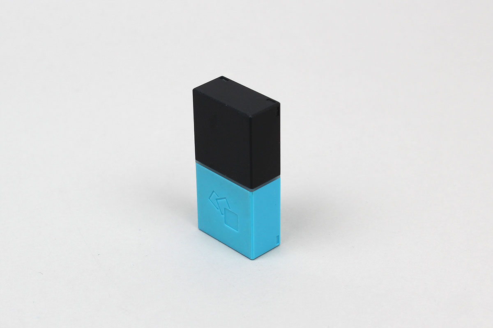

# MESH-100AC (MESH Move) 
MESH-100AC (MESH Move) is an app-enabled accelerometer of MESH blocks.

MESH official web site is [here](https://meshprj.com/).



# Requirement
MESH block : version 1.2.5 or higher

# Use case

```javascript
// Example
const MESH_100AC = Obniz.getPartsClass('MESH_100AC');
obniz.ble.scan.onfind = async (peripheral) => {
    if (!MESH_100AC.isMESHblock(peripheral)) {
        return;
    }
    console.log('found');

    // Create an instance
    const moveBlock = new MESH_100AC(peripheral);

    // Connect to the Move block
    await moveBlock.connectWait();
    console.log(`connected: ${moveBlock.peripheral.localName}`);
    
    // Tap Event
    moveBlock.onTapped = (accele) => {
        console.log('tapped! (ax, ay, az) = (' + accele.x + ', ' + accele.y + ',' + accele.z + ')');
    };

    // Shake Event
    moveBlock.onShaked = (accele) => {
        console.log('shaked! (ax, ay, az) = (' + accele.x + ', ' + accele.y + ',' + accele.z + ')');
    };

    // Flip Event
    moveBlock.onFlipped = (accele) => {
        console.log('flipped! (ax, ay, az) = (' + accele.x + ', ' + accele.y + ',' + accele.z + ')');
    };
    
    // Orientation Event
    moveBlock.onOrientationChanged = (orientation, accele) => {
        console.log('orientation changed! ' + orientation + ', (ax, ay, az) = (' + accele.x + ', ' + accele.y + ',' + accele.z + ')');
    };
};

```

# Related documents
[MESH technical specification](https://developer.meshprj.com/).
