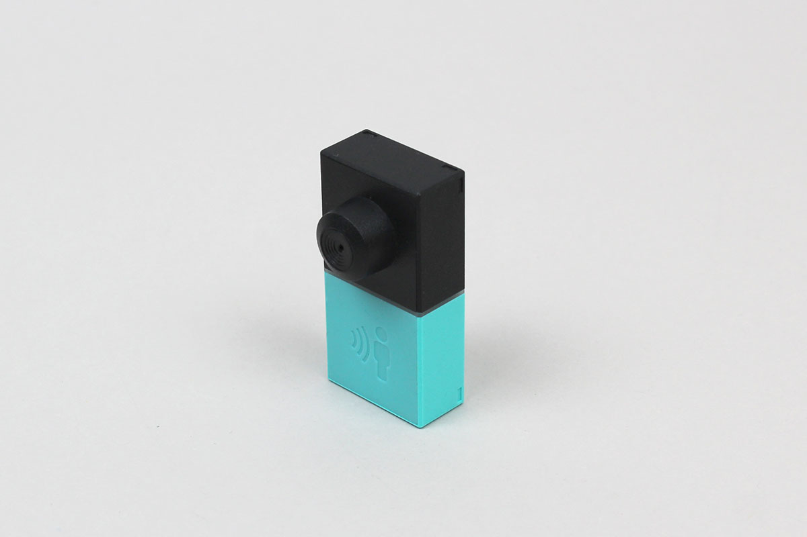

# MESH-100MD (MESH Motion)
MESH-100MD (MESH Motion) is an app-enabled infrared motion sensor of MESH blocks.

MESH official web site is [here](https://meshprj.com/).



# Requirement
MESH block : version 1.2.5 or higher

# Use case

```javascript
// Example
const MESH_100MD = Obniz.getPartsClass('MESH_100MD');
obniz.ble.scan.onfind = async (peripheral) => {
    if (!MESH_100MD.isMESHblock(peripheral)) {
        return;
    }
    console.log('found');

    // Create an instance
    const motionBlock = new MESH_100MD(peripheral);

    // Connect to the Motion block
    await motionBlock.connectWait();
    console.log(`connected: ${motionBlock.peripheral.localName}`);
    
    // Get sensor data
    const motionState = await motionBlock.getSensorDataWait();
    switch (motionState) {
        case MESH_100MD.MotionState.DETECTED: {
            console.log('Detected!');
            break;
        }
        case MESH_100MD.MotionState.NOT_DETECTED: {
            console.log('Not Detected.');
            break;
        }
        default: {
            console.log('Starting up...');
            break;
        }
    }
};

```

```javascript
// Example
const MESH_100MD = Obniz.getPartsClass('MESH_100MD');
obniz.ble.scan.onfind = async (peripheral) => {
    if (!MESH_100MD.isMESHblock(peripheral)) {
        return;
    }
    console.log('found');

    // Create an instance
    const motionBlock = new MESH_100MD(peripheral);

    // Connect to the Motion block
    await motionBlock.connectWait();
    console.log(`connected: ${motionBlock.peripheral.localName}`);
    
    // Set event handler
    motionBlock.onSensorEvent = ((motionState, notifyMode) => {
        switch (motionState) {
            case MESH_100MD.MotionState.DETECTED: {
                console.log('Detected !');
                break;
            }
            case MESH_100MD.MotionState.NOT_DETECTED: {
                console.log('Not Detected.');
                break;
            }
            default: {
                console.log('Starting up...');
                break;
            }
        }
    });

    // Prepare params
    const notifyMode = MESH_100MD.NotifyMode.ALWAYS;
    
    // Write
    motionBlock.setMode(notifyMode);
};

```

# Related documents
[MESH technical specification](https://developer.meshprj.com/).
