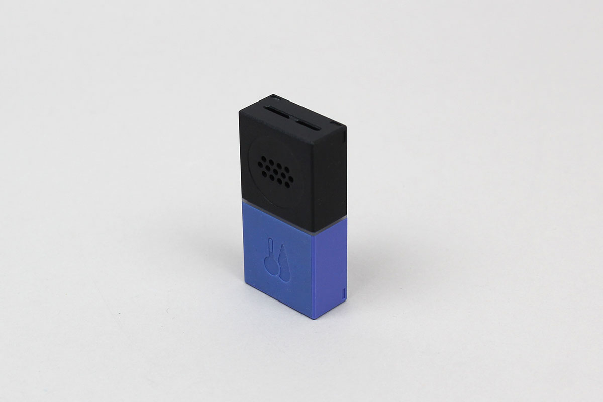

# MESH-100TH (MESH Temperature & Humidity)
MESH-100TH (MESH Temperature & Humidity) is an app-enabled temperature and humidity sensor of MESH blocks.

MESH official web site is [here](https://meshprj.com/).



# Requirement
MESH block : version 1.2.5 or higher

# Use case

```javascript
// Example
const MESH_100TH = Obniz.getPartsClass('MESH_100TH');
obniz.ble.scan.onfind = async (peripheral) => {
    if (!MESH_100TH.isMESHblock(peripheral)) {
        return;
    }
    console.log('found');

    // Create an instance
    const temphumidBlock = new MESH_100TH(peripheral);

    // Connect to the Temperature & Humidity block
    await temphumidBlock.connectWait();
    console.log(`connected: ${temphumidBlock.peripheral.localName}`);
    
    // Get sensor data
    const res = await temphumidBlock.getSensorDataWait();
    console.log('temperature: ' + res.temperature + ', humidity: ' + res.humidity);
};

```

```javascript
// Example
const MESH_100TH = Obniz.getPartsClass('MESH_100TH');
obniz.ble.scan.onfind = async (peripheral) => {
    if (!MESH_100TH.isMESHblock(peripheral)) {
        return;
    }
    console.log('found');

    // Create an instance
    const temphumidBlock = new MESH_100TH(peripheral);

    // Connect to the Temperature & Humidity block
    await temphumidBlock.connectWait();
    console.log(`connected: ${temphumidBlock.peripheral.localName}`);
    
    // Set event handler
    temphumidBlock.onSensorEvent = ((temperature, humidity) => {
        console.log('temperature: ' + temperature + ', humidity: ' + humidity);
    });

    // Prepare params (See the linked page below for more information.)
    const notifyMode = MESH_100TH.NotifyMode.ALWAYS;
    const tempUpper = 50;
    const tempLower = -10;
    const humidUpper = 100;
    const humidLower = 0;
    const tempCondition = MESH_100TH.EmitCondition.ABOVE_UPPER_OR_ABOVE_LOWER;
    const humidCondition = MESH_100TH.EmitCondition.ABOVE_UPPER_OR_ABOVE_LOWER;
    
    // Write
    temphumidBlock.setMode(
        tempUpper,
        tempLower,
        humidUpper,
        humidLower,
        tempCondition,
        humidCondition,
        notifyMode
    );
};

```

# Related documents

[MESH technical specification](https://developer.meshprj.com/)
