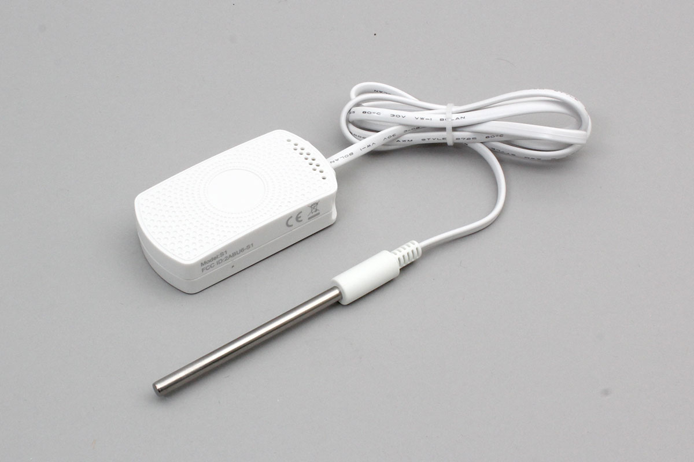

# MINEW_S1
MINEW社製の温湿度ビーコンです。
事前に専用アプリによりビーコン出力の設定をする必要があります。

SLOTはHT Sensor / Infoのみ対応しています。




## isDevice(peripheral)

BLEで受信したアドバタイズ情報をもとに、MINEW_S1 かどうかを判定します。
受信したアドバタイズのSLOTがHT Sensor / Info の場合のみ、trueを返します。
SLOTがiBeacon / UID / URL / TLM は非対応で、falseを返します。

```javascript
// Javascript Example
await obniz.ble.initWait();
const MINEW_S1 = Obniz.getPartsClass("MINEW_S1");
obniz.ble.scan.onfind = async (peripheral) => {
  if (MINEW_S1.isDevice(peripheral)) {
    console.log("device find");
  }
};
await obniz.ble.scan.startWait();

```


## getHTData()
BLEで受信したアドバタイズ情報をもとに、温湿度データを取得します。
違うSLOTのアドバタイズ情報の場合はnullを返します。

```javascript
// Javascript Example
await obniz.ble.initWait();
const MINEW_S1 = Obniz.getPartsClass("MINEW_S1");
obniz.ble.scan.onfind = (peripheral) => {
  if (MINEW_S1.isDevice(peripheral)) {
    const data = MINEW_S1.getHTData(peripheral);
    console.log(data); 
  }
};
await obniz.ble.scan.startWait();

```

返り値のフォーマットは下記のとおりです。

```javascript
{
  frameType: number;
  versionNumber: number;
  batteryLevel: number;
  temperature: number;
  humidity: number;
  macAddress: string;
}
```


## getInfoData()
BLEで受信したアドバタイズ情報をもとに、デバイス情報を取得します。
違うSLOTのアドバタイズ情報の場合はnullを返します。

```javascript
// Javascript Example
await obniz.ble.initWait();
const MINEW_S1 = Obniz.getPartsClass("MINEW_S1");
obniz.ble.scan.onfind = (peripheral) => {
  if (MINEW_S1.isDevice(peripheral)) {
    const data = MINEW_S1.getInfoData(peripheral);
    console.log(data); 
  }
};
await obniz.ble.scan.startWait();

```

返り値のフォーマットは下記のとおりです。

```javascript
{
  frameType: number;
  versionNumber: number;
  batteryLevel: number;
  macAddress: string;
  name: string;
}
```
