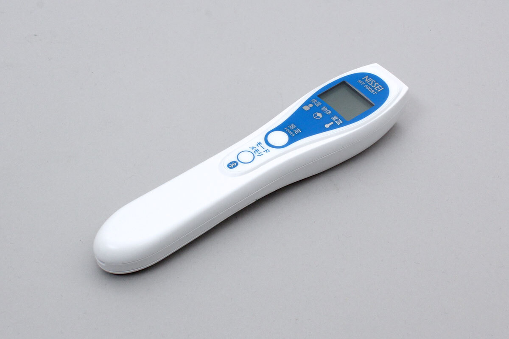

# MT_500BT

This is a non-contact temperature sensor manufactured by Nihon Seimitsu Sokki.


## isDevice(peripheral)


Determine whether the MT_500BT is a MT_500BT based on the advertisement information received by the BLE.

```javascript
// Javascript Example
await obniz.ble.initWait();
const MT_500BT = Obniz.getPartsClass("MT_500BT");
obniz.ble.scan.onfind = async (peripheral) => {
  if (MT_500BT.isDevice(peripheral)) {
    console.log("device find");
  }
};
await obniz.ble.scan.startWait();

```

## new MT_500BT(peripheral)

Create an instance based on the advertisement information received by the BLE.

```javascript
// Javascript Example
await obniz.ble.initWait();
const MT_500BT = Obniz.getPartsClass("MT_500BT");
obniz.ble.scan.onfind = async (peripheral) => {
  if (MT_500BT.isDevice(peripheral) ) {
    console.log("device find");
    const device = new MT_500BT(peripheral);
  }
};
await obniz.ble.scan.startWait();

```


## [await]connectWait()

Connect to the device. After connecting, you will be able to authenticate to the device.

```javascript
// Javascript Example
await obniz.ble.initWait();
const MT_500BT = Obniz.getPartsClass("MT_500BT");
obniz.ble.scan.onfind = async (peripheral) => {
  if (MT_500BT.isDevice(peripheral)) {
    console.log("find");
    const device = new MT_500BT(peripheral);
    device.ondisconnect = (reason) => {
      console.log(reason)
    }
    await device.connectWait();
    console.log("connected");
    const tempInfo = await device.getTemperatureWait();
    console.log(tempInfo);
  }
};
await obniz.ble.scan.startWait();

```


## [await]disconnectWait()
Disconnect from the sensor.

```javascript
// Javascript Example
await obniz.ble.initWait();
const MT_500BT = Obniz.getPartsClass("MT_500BT");
obniz.ble.scan.onfind = async (peripheral) => {
  if (MT_500BT.isDevice(peripheral) ) {
    console.log("find");
    const device = new MT_500BT(peripheral);
    await device.connectWait();
    console.log("connected");
    await device.disconnectWait();
    console.log("disconnected");
  }
};
await obniz.ble.scan.startWait();

```

## getTemperatureWait
Get information from the device's built-in temperature and humidity sensors.

```javascript
// Javascript Example
await obniz.ble.initWait();
const MT_500BT = Obniz.getPartsClass("MT_500BT");
obniz.ble.scan.onfind = async (peripheral) => {
  if (MT_500BT.isDevice(peripheral)) {
    console.log("find");
    const device = new MT_500BT(peripheral);
    device.ondisconnect = (reason) => {
      console.log(reason)
    }
    await device.connectWait();
    console.log("connected");
    const tempInfo = await device.getTemperatureWait();
    console.log(tempInfo);
  }
};
await obniz.ble.scan.startWait();

```

The format of the return value is as follows

```javascript
{ timestamp: {
     year: 2020,
     month: 8,
     day: 25,
     hour: 10,
     minute: 21,
     second: 32 
   },
  temperature: {
    body: 36.4,
    material: undefined,
    air: 28.9
  } 
}
```

If the device has no date set, then all year~second in the timestamp will be undefined.
