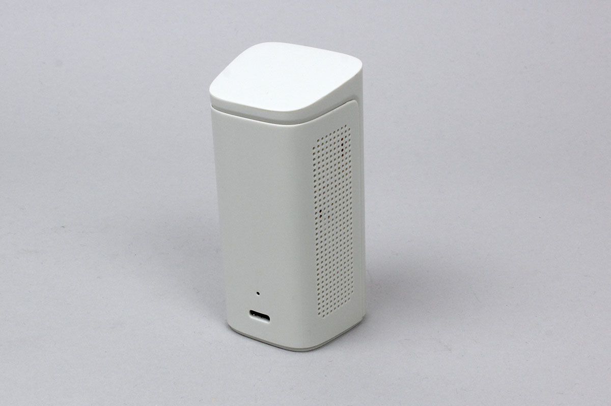

# MiniBreeze
This is a temperature, humidity and gas sensor made by SENKO.




## isDevice(peripheral)

Based on the advertisement information received by the BLE, it is determined whether it is MiniBreeze or not.

```javascript
// Javascript Example
await obniz.ble.initWait();
const MiniBreeze = Obniz.getPartsClass("MiniBreeze");
obniz.ble.scan.onfind = async (peripheral) => {
  if (MiniBreeze.isDevice(peripheral)) {
    console.log("device find");
  }
};
await obniz.ble.scan.startWait();

```


## getData()

Acquires temperature, humidity and gas data based on the advertisement information received by the BLE.
Returns null in the case of advertisement information of a different SLOT.

```javascript
// Javascript Example
await obniz.ble.initWait();
const MiniBreeze = Obniz.getPartsClass("MiniBreeze");
obniz.ble.scan.onfind = (peripheral) => {
  if (MiniBreeze.isDevice(peripheral)) {
    const data = MiniBreeze.getData(peripheral);
    console.log(data); 
  }
};
await obniz.ble.scan.startWait();

```

The format of the return value is as follows

```javascript
{
  gasType: "none" | "HCHO" | "CO" | "CO2" | "Rn" | "PM1.0" | "PM2.5" | "PM10" | "unknown";
  sensVal: number;
  temperature: number;
  humidity: number;
  version: string;
  status: "BatteryEmpty" | "BatteryLow" | "BatteryNormal" | "BatteryCharging" | "Invalid";
  devName: string;
}
```

