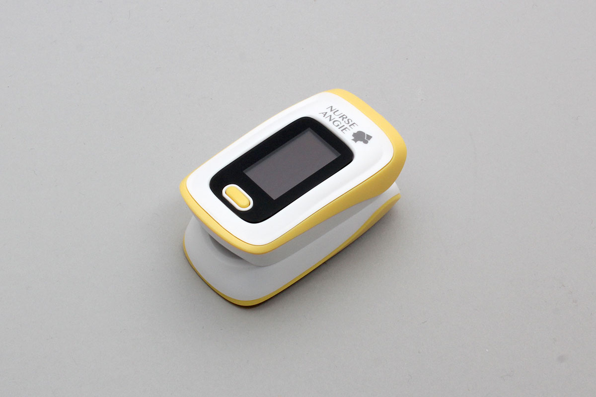

# PLS_01BT
株式会社カスタム社製の　酸素飽和度メータです


## isDevice(peripheral)

BLEで受信したアドバタイズ情報をもとに、PLS_01BT かどうかを判定します

```javascript
// Javascript Example
await obniz.ble.initWait();
const PLS_01BT = Obniz.getPartsClass("PLS_01BT");
obniz.ble.scan.onfind = async (peripheral) => {
  if (PLS_01BT.isDevice(peripheral)) {
    console.log("find");
  }
};
await obniz.ble.scan.startWait();

```

## new PLS_01BT(peripheral)

BLEで受信したアドバタイズ情報をもとに、インスタンスを作成します。

```javascript
// Javascript Example

await obniz.ble.initWait();
const PLS_01BT = Obniz.getPartsClass("PLS_01BT");
obniz.ble.scan.onfind = async (peripheral) => {
  if (PLS_01BT.isDevice(peripheral)) {
    console.log("find");
    const device = new PLS_01BT(peripheral);
  }
};
await obniz.ble.scan.startWait();

```


## [await]connectWait()
デバイスに接続します。


```javascript
// Javascript Example

await obniz.ble.initWait();
const PLS_01BT = Obniz.getPartsClass("PLS_01BT");
obniz.ble.scan.onfind = async (peripheral) => {
  if (PLS_01BT.isDevice(peripheral)) {
    console.log("find");
    const device = new PLS_01BT(peripheral);
    device.ondisconnect = (reason) => {
      console.log(reason)
    }
    await device.connectWait();
    console.log("connected");
  }
};
await obniz.ble.scan.startWait();

```


## [await]disconnectWait()
センサから切断します

```javascript
// Javascript Example
await obniz.ble.initWait();
const PLS_01BT = Obniz.getPartsClass("PLS_01BT");
obniz.ble.scan.onfind = async (peripheral) => {
  if (PLS_01BT.isDevice(peripheral)) {
    console.log("find");
    const device = new PLS_01BT(peripheral);
    await device.connectWait();
    console.log("connected");
    await device.disconnectWait();
    console.log("disconnected");
  }
};
await obniz.ble.scan.startWait();

```


## onmesured
計測が完了した際によばれます。通常1秒に1度呼ばれます

```javascript
// Javascript Example
await obniz.ble.initWait();
const PLS_01BT = Obniz.getPartsClass("PLS_01BT");
obniz.ble.scan.onfind = async (peripheral) => {
  if (PLS_01BT.isDevice(peripheral)) {
    console.log("find");
    const device = new PLS_01BT(peripheral);
    await device.connectWait();
    console.log("connected");
    device.onmesured = (data) => {
      console.log(data);
    };
  }
};
await obniz.ble.scan.startWait();

```

出力形式は次のとおりです

```
 {
  pulseRate: number; [bpm]
  bloodOxygenLevel: number; [%]
  perfusionIndex: number; 
}
```
