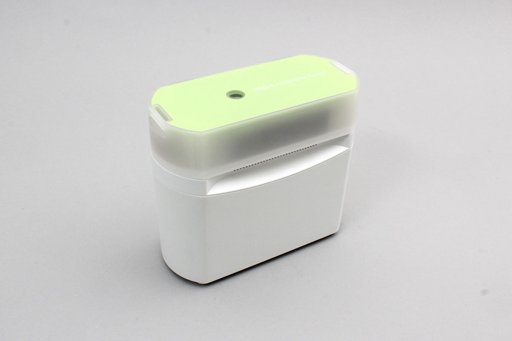

# REX_BTPM25V
ラトックシステムズ社製のエアクオリティモニタです



## isDevice(peripheral)

BLEで受信したアドバタイズ情報をもとに、REX_BTPM25V かどうかを判定します

```javascript
// Javascript Example
await obniz.ble.initWait();
const REX_BTPM25V = Obniz.getPartsClass("REX_BTPM25V");
obniz.ble.scan.onfind = async (peripheral) => {
  if (REX_BTPM25V.isDevice(peripheral)) {
    console.log("find");
  }
};
await obniz.ble.scan.startWait();

```

## new REX_BTPM25V(peripheral)

BLEで受信したアドバタイズ情報をもとに、インスタンスを作成します。

```javascript
// Javascript Example

await obniz.ble.initWait();
const REX_BTPM25V = Obniz.getPartsClass("REX_BTPM25V");
obniz.ble.scan.onfind = async (peripheral) => {
  if (REX_BTPM25V.isDevice(peripheral)) {
    console.log("find");
    const device = new REX_BTPM25V(peripheral);
  }
};
await obniz.ble.scan.startWait();

```


## [await]connectWait()
デバイスに接続します。


```javascript
// Javascript Example

await obniz.ble.initWait();
const REX_BTPM25V = Obniz.getPartsClass("REX_BTPM25V");
obniz.ble.scan.onfind = async (peripheral) => {
  if (REX_BTPM25V.isDevice(peripheral)) {
    console.log("find");
    const device = new REX_BTPM25V(peripheral);
    device.ondisconnect = (reason) => {
      console.log(reason)
    }
    await device.connectWait();
    console.log("connected");
  }
};
await obniz.ble.scan.startWait();

```


## [await]disconnectWait()
センサから切断します

```javascript
// Javascript Example
await obniz.ble.initWait();
const REX_BTPM25V = Obniz.getPartsClass("REX_BTPM25V");
obniz.ble.scan.onfind = async (peripheral) => {
  if (REX_BTPM25V.isDevice(peripheral)) {
    console.log("find");
    const device = new REX_BTPM25V(peripheral);
    await device.connectWait();
    console.log("connected");
    await device.disconnectWait();
    console.log("disconnected");
  }
};
await obniz.ble.scan.startWait();

```


## onbuttonpressed
ボタンが押されたときにコールバックします。

```javascript
// Javascript Example
await obniz.ble.initWait();
const REX_BTPM25V = Obniz.getPartsClass("REX_BTPM25V");
obniz.ble.scan.onfind = async (peripheral) => {
  if (REX_BTPM25V.isDevice(peripheral)) {
    console.log("find");
    const device = new REX_BTPM25V(peripheral);
    await device.connectWait();
    console.log("connected");
    device.onbuttonpressed = (pressed) => {
      console.log("pressed " + pressed);
    };
  }
};
await obniz.ble.scan.startWait();

```


## measureOneShotExtWait
エアクオリティを計測します。

```javascript
// Javascript Example
await obniz.ble.initWait();
const REX_BTPM25V = Obniz.getPartsClass("REX_BTPM25V");
obniz.ble.scan.onfind = async (peripheral) => {
  if (REX_BTPM25V.isDevice(peripheral)) {
    console.log("find");
    const device = new REX_BTPM25V(peripheral);
    await device.connectWait();
    console.log("connected");
    const data = await device.measureOneShotExtWait();
    console.log(data);
  }
};
await obniz.ble.scan.startWait();

```

出力形式は次のとおりです

```

{
  pm2_5 : 23, // [μg/m^3]
  pm10 : 22,  // [μg/m^3]
  barometricPressure : 1007.9, // [μg/m^3]
  temperature : 21.4, // [degree]
  humidity : 62.1, // [%]
  lux : 828,  // [lux]
  tvoc : 3,  // [ppb]
  eco2 : 424, //[ppm]
  uv : 0  // [UVI]
}
```
