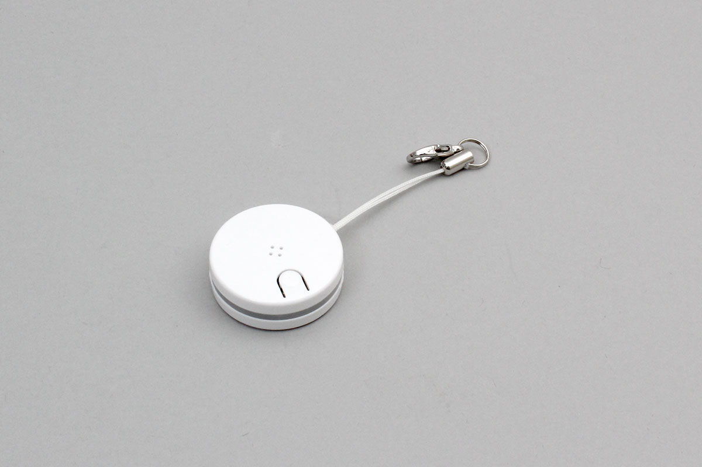

# RS_SEEK3
ラトックシステムズ社製の紛失防止タグです。電池駆動でビーコンを発信します。また、接続することで内部の温度センサーとボタンもBLE経由で利用できます。



## isDevice(peripheral)

BLEで受信したアドバタイズ情報をもとに、RS_SEEK3かどうかを判定します

```javascript
// Javascript Example
await obniz.ble.initWait();
const RS_Seek3 = Obniz.getPartsClass("RS_Seek3");
obniz.ble.scan.onfind = async (peripheral) => {
  if (RS_Seek3.isDevice(peripheral)) {
    console.log("device find");
  }
};
await obniz.ble.scan.startWait();

```

## new RS_Seek3(peripheral)

BLEで受信したアドバタイズ情報をもとに、インスタンスを作成します。

```javascript
// Javascript Example
await obniz.ble.initWait();
const RS_Seek3 = Obniz.getPartsClass("RS_Seek3");
obniz.ble.scan.onfind = async (peripheral) => {
  if (RS_Seek3.isDevice(peripheral) ) {
    console.log("device find");
    const device = new RS_Seek3(peripheral);
  }
};
await obniz.ble.scan.startWait();

```


## [await]connectWait()
デバイスに接続します。


```javascript
// Javascript Example
await obniz.ble.initWait();
const RS_Seek3 = Obniz.getPartsClass("RS_Seek3");
obniz.ble.scan.onfind = async (peripheral) => {
  if (RS_Seek3.isDevice(peripheral)) {
    console.log("find");
    const device = new RS_Seek3(peripheral);
    device.ondisconnect = (reason) => {
      console.log(reason)
    }
    await device.connectWait();
    console.log("connected");
    device.onpressed = () => {
      console.log("pressed");
    };
    console.log(await device.getTempHumidWait());
  }
};
await obniz.ble.scan.startWait();

```


## [await]disconnectWait()
センサから切断します

```javascript
// Javascript Example
await obniz.ble.initWait();
const RS_Seek3 = Obniz.getPartsClass("RS_Seek3");
obniz.ble.scan.onfind = async (peripheral) => {
  if (RS_Seek3.isDevice(peripheral) ) {
    console.log("find");
    const device = new RS_Seek3(peripheral);
    await device.connectWait();
    console.log("connected");
    await device.disconnectWait();
    console.log("disconnected");
  }
};
await obniz.ble.scan.startWait();

```


## onpressed
ボタンが押されたときにコールバックします。
離されたときには反応しません。

```javascript
// Javascript Example
await obniz.ble.initWait();
const RS_Seek3 = Obniz.getPartsClass("RS_Seek3");
obniz.ble.scan.onfind = async (peripheral) => {
  if (RS_Seek3.isDevice(peripheral)) {
    console.log("find");
    const device = new RS_Seek3(peripheral);
    await device.connectWait();
    console.log("connected");
    device.onpressed = () => {
      console.log("pressed");
    };
    console.log(await device.getTempHumidWait());
  }
};
await obniz.ble.scan.startWait();

```


## getTempHumidWait
デバイス内臓の温湿度センサの情報を取得します。

```javascript
// Javascript Example
await obniz.ble.initWait();
const RS_Seek3 = Obniz.getPartsClass("RS_Seek3");
obniz.ble.scan.onfind = async (peripheral) => {
  if (RS_Seek3.isDevice(peripheral) && isFirst) {
    console.log("find");
    const device = new RS_Seek3(peripheral);
    await device.connectWait();
    console.log("connected");
    console.log(await device.getTempHumidWait());
  }
};
await obniz.ble.scan.startWait();


```
