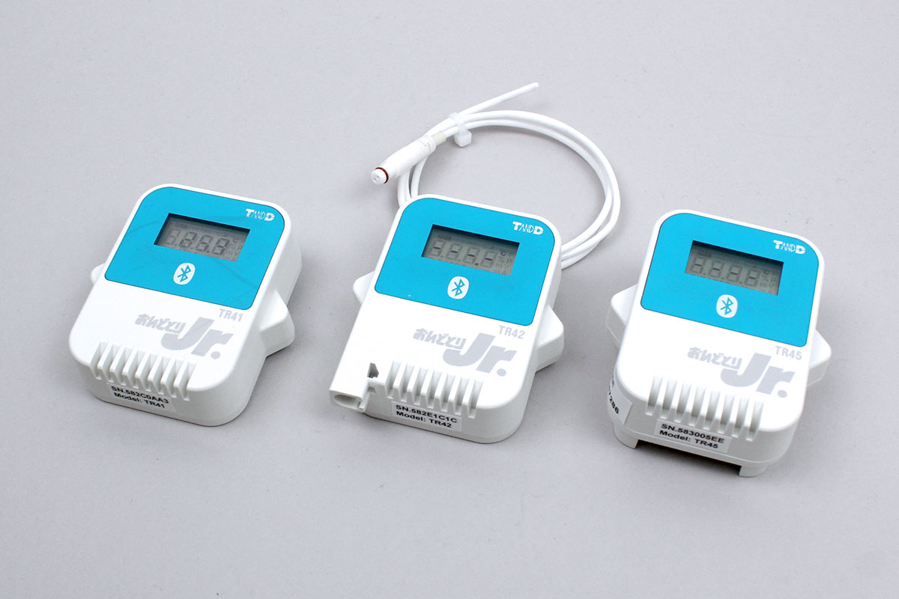

# Tr4

T and D社製のBLE通信の温度センサシリーズです

TR41, TR42、TR45に対応しています



## データ取得
アドバタイズされているデータを取得


結果は次のフォーマットで取得できます
```
{
  temperature: 温度 [度];
}
```


```javascript
// Javascript Example
const tr4 = Obniz.getPartsClass('TR4');
await obniz.ble.initWait();
obniz.ble.scan.onfind = (p) => {
    if (tr4.isDevice(p)) {
        const data = tr4.getData(p);
        console.log(data);
    }
};
await obniz.ble.scan.startWait(null, { duplicate: true, duration: null });
```
