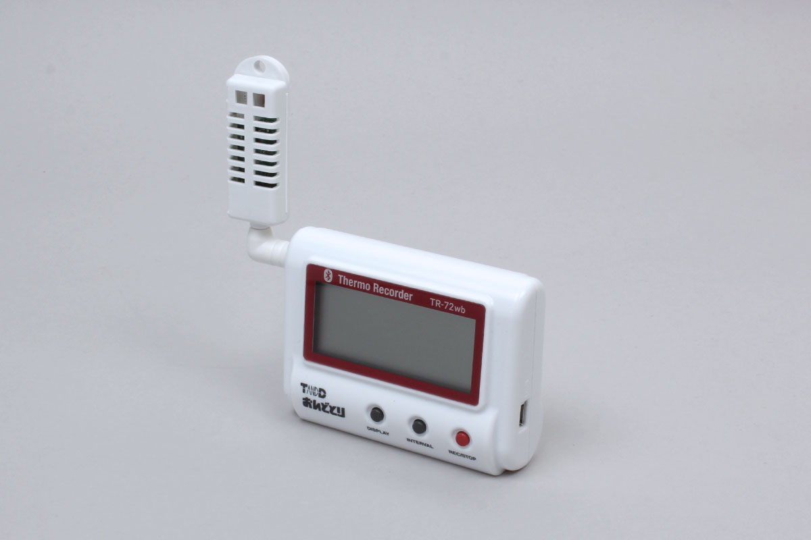

# TR7 series

T and D社製のBLE通信の温湿度センサシリーズです。

TR71, TR72、TR75に対応しています。



## データ取得
アドバタイズされているデータを取得。


結果は次のフォーマットで取得できます
```
{
  deviceSerial: デバイスシリアル
  controlCode: コントロールコード
  counter: カウンタ
  statusCode1: ステータスコード1
  statusCode2: ステータスコード2
  temperature: 温度 [度];
  humidity: 湿度 [パーセント];
}
```

### コントロールコードについて

R71A/TR75A:0(未使用)
TR72A:湿度(1%精度)=0 湿度(0.1%精度)=1

### カウンタについて

上位4bit:警報がONになったら+1 (0〜15)
下位4bit:設定が変更されたら+1 (0〜15)

### ステータスコード1について

0(LSB) 停止=0 / 記録中=1
1 記録開始予約中=1 / 記録中又は記録停止=0
2 未使用
3 温度表示単位 摂氏=0 / 華氏=1
4 BLE通信セキュリティON=1 / OFF=0
5 未使用
6 未使用
7(MSB) 未使用

### ステータスコード2について

0(LSB) 電池レベル 0〜5(残量なし〜残量あり)
1↑
2↑
3 USB電源 無し=0 / あり=1
4 Ch1 上限値警報 警報状態=1 / 警報状態ではない=0
5 Ch1 下限値警報 警報状態=1 / 警報状態ではない=0
6 Ch2 上限値警報 警報状態=1 / 警報状態ではない=0
7(MSB) Ch2 下限値警報 警報状態=1 / 警報状態ではない=0


```javascript
// Javascript Example
const TR7 = Obniz.getPartsClass('TR7');
await obniz.ble.initWait();
obniz.ble.scan.onfind = (p) => {
    if (TR7.isDevice(p)) {
        const data = TR7.getData(p);
        console.log(data);
    }
};
await obniz.ble.scan.startWait(null, { duplicate: true, duration: null });
```
