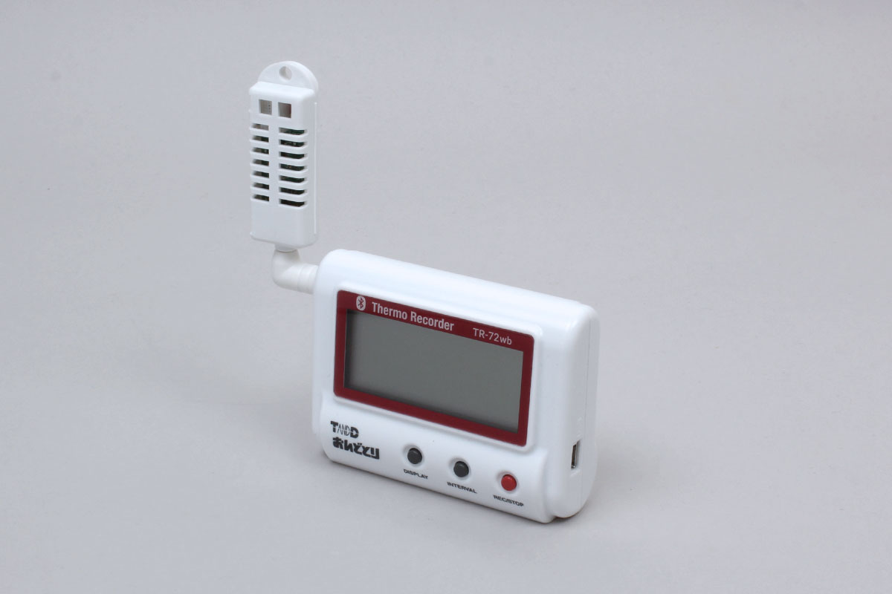

# TR7 series

This is BLE sensor series from T&D corporation.
They can measure temperature and humidity data.

obniz.js supports TR71, TR72 and TR75.



## Get the data
Extract the data from an advertisement.


Result format:
```json
{
  temperature: Temperature [degC];
  humidity: Humidity [Percentage];
}
```


```javascript
// Javascript Example
const TR7 = Obniz.getPartsClass('TR7');
await obniz.ble.initWait();
obniz.ble.scan.onfind = (p) => {
    if (TR7.isDevice(p)) {
        const data = TR7.getData(p);
        console.log(data);
    }
};
await obniz.ble.scan.startWait(null, { duplicate: true, duration: null });
```
