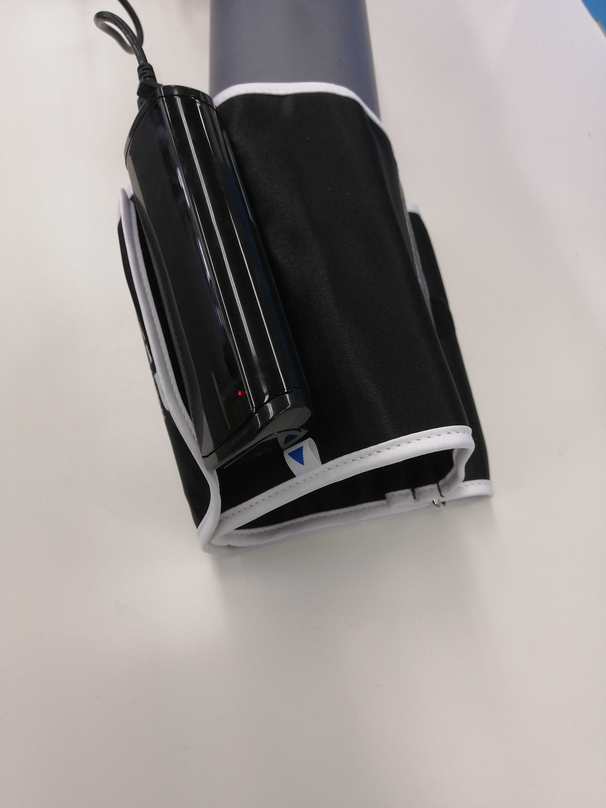

# UA1200BLE
This is a blood pressure meter from A&D Corporation.



## isDevice(peripheral)

Judges whether or not it is UA1200BLE based on the advertised information received by the BLE.
```javascript
// Javascript Example
await obniz.ble.initWait();
const UA1200BLE = Obniz.getPartsClass("UA1200BLE");
obniz.ble.scan.onfind = async (peripheral) => {
  if (UA1200BLE.isDevice(peripheral)) {
    console.log("device find");
  }
};
await obniz.ble.scan.startWait();

```

## new UA1200BLE(peripheral)

Instances are created based on the advertised information received by the BLE.

```javascript
// Javascript Example
await obniz.ble.initWait();
const UA1200BLE = Obniz.getPartsClass("UA1200BLE");
obniz.ble.scan.onfind = async (peripheral) => {
  if (UA1200BLE.isDevice(peripheral) ) {
    console.log("device find");
    const device = new UA1200BLE(peripheral);
  }
};
await obniz.ble.scan.startWait();

```


## [await]getDataWait()

Connects to the device and collects data in batches.
This device will send out an advertisement whether data is present or not.
If no data is available, no data will be obtained by connecting. If `isCooperationMode()` is `true`, there is no data.
Also, the only data that can be obtained is the data that the device has not yet sent.

After the data is sent, the connection to the device is automatically terminated.

```javascript
// Javascript Example
await obniz.ble.initWait();
const UA1200BLE = Obniz.getPartsClass("UA1200BLE");
obniz.ble.scan.onfind = async (peripheral) => {
  if (UA1200BLE.isDevice(peripheral)) {
    console.log("find");
    const device = new UA1200BLE(peripheral);
    
    const data = await device.getDataWait();
    
    console.log(data);
    // {
    // SystolicPressure_mmHg?: number;
    // DiastolicPressure_mmHg?: number;
    // MeanArterialPressure_mmHg?: number;
    // SystolicPressure_kPa?: number;
    // DiastolicPressure_kPa?: number;
    // MeanArterialPressure_kPa?: number;
    // PulseRate?: number;
    //   }
  }
};
await obniz.ble.scan.startWait();

```


Output format is here. Blood pressure data is in mmHg or kPa format, and Pulse rate data is in pulse/min format.

```json
{
  SystolicPressure_mmHg?: number;
  DiastolicPressure_mmHg?: number;
  MeanArterialPressure_mmHg?: number;
  SystolicPressure_kPa?: number;
  DiastolicPressure_kPa?: number;
  MeanArterialPressure_kPa?: number;
  PulseRate?: number;
}
```
