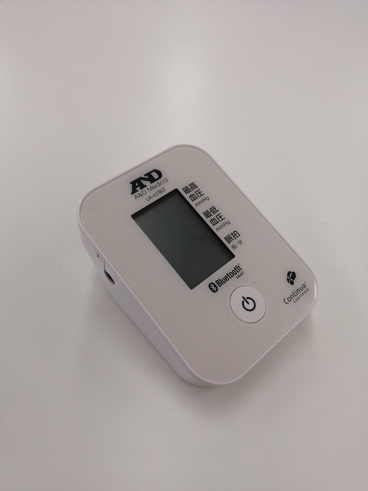

# UA651BLE
This is a blood pressure meter from A&D Corporation.

Pairing is required for data communication. Pairing can be done by pressing and holding the power button until "Pr" is displayed.
The device will record the paired device, return localName only to that device, and transfer data only to that device after the connection is established.



## isDevice(peripheral)

Judges whether or not it is UA651BLE based on the advertised information received by the BLE.

* If communication errors occur frequently, try re-pairing the UA651BLE.

```javascript
// Javascript Example
await obniz.ble.initWait();
const UA651BLE = Obniz.getPartsClass("UA651BLE");
obniz.ble.scan.onfind = async (peripheral) => {
  if (UA651BLE.isDevice(peripheral)) {
    console.log("device find");
  }
};
await obniz.ble.scan.startWait();

```

## new UA651BLE(peripheral)

Instances are created based on the advertised information received by the BLE.

```javascript
// Javascript Example
await obniz.ble.initWait();
const UA651BLE = Obniz.getPartsClass("UA651BLE");
obniz.ble.scan.onfind = async (peripheral) => {
  if (UA651BLE.isDevice(peripheral) ) {
    console.log("device find");
    const device = new UA651BLE(peripheral);
  }
};
await obniz.ble.scan.startWait();

```


## [await]getDataWait()

Connects to the device and collects data in batches.
The only data that can be retrieved is the data that the device has not yet sent.

After the data is sent, the connection to the device is automatically terminated.

```javascript
// Javascript Example
await obniz.ble.initWait();
const UA651BLE = Obniz.getPartsClass("UA651BLE");
obniz.ble.scan.onfind = async (peripheral) => {
  if (UA651BLE.isDevice(peripheral)) {
    console.log("find");
    const device = new UA651BLE(peripheral);
    
    const data = await device.getDataWait();
    
    console.log(data);
    // {
    // SystolicPressure_mmHg?: number;
    // DiastolicPressure_mmHg?: number;
    // MeanArterialPressure_mmHg?: number;
    // SystolicPressure_kPa?: number;
    // DiastolicPressure_kPa?: number;
    // MeanArterialPressure_kPa?: number;
    // PulseRate?: number;
    //   }
  }
};
await obniz.ble.scan.startWait();

```


Output format is here. Blood pressure data is in mmHg or kPa format, and Pulse rate data is in pulse/min format.

```json
{
  SystolicPressure_mmHg?: number;
  DiastolicPressure_mmHg?: number;
  MeanArterialPressure_mmHg?: number;
  SystolicPressure_kPa?: number;
  DiastolicPressure_kPa?: number;
  MeanArterialPressure_kPa?: number;
  PulseRate?: number;
}
```
