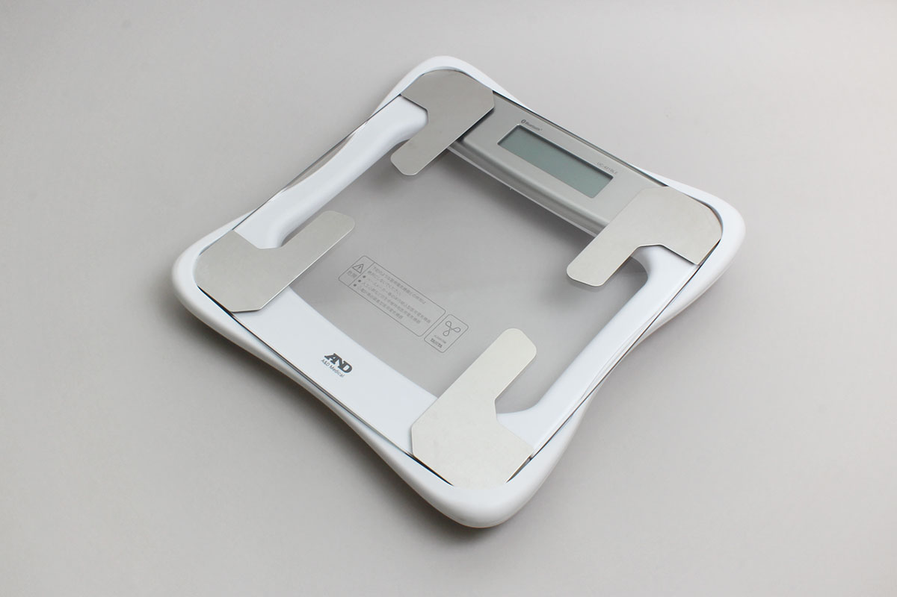

# UC421BLE
A&D社から発売されている体組成計です。体重情報と体組成情報が測定できます。



## isDevice(peripheral)

BLEで受信したアドバタイズ情報を元に、UC421BLEかどうか判定します。
```javascript
// Javascript Example
await obniz.ble.initWait();
const UC421BLE = Obniz.getPartsClass("UC421BLE");
obniz.ble.scan.onfind = async (peripheral) => {
  if (UC421BLE.isDevice(peripheral)) {
    console.log("device find");
  }
};
await obniz.ble.scan.startWait();

```


## getManufacturerSpecificDataFromAdv(peripheral)

BLEで受信したアドバタイズ情報をパースして'Manufacturer Specific Data'を取得します。

```javascript
// Javascript Example
await obniz.ble.initWait();
const UC421BLE = Obniz.getPartsClass("UC421BLE");
obniz.ble.scan.onfind = async (peripheral) => {
  if (UC421BLE.isDevice(peripheral)) {
      console.log("device find");
      const msData = UC421BLE.getManufacturerSpecificDataFromAdv(peripheral);
      if (msData.opMode.runningMode === 'measurementWithApp') {
        // do something
      } else {
        // do something
      }
  }
};
await obniz.ble.scan.startWait();

```


## new UC421BLE(peripheral)

BLEで受信したアドバタイズ情報をもとに、インスタンスを作成します。

```javascript
// Javascript Example
await obniz.ble.initWait();
const UC421BLE = Obniz.getPartsClass("UC421BLE");
obniz.ble.scan.onfind = async (peripheral) => {
  if (UC421BLE.isDevice(peripheral) ) {
    console.log("device find");
    const device = new UC421BLE(peripheral);
  }
};
await obniz.ble.scan.startWait();

```

## [await]aquireNewUserNoWait(cc)

新規ユーザNoを取得します。

```javascript
// Javascript Example
await obniz.ble.initWait();
const UC421BLE = Obniz.getPartsClass("UC421BLE");
obniz.ble.scan.onfind = async (peripheral) => {
  if (UC421BLE.isDevice(peripheral) ) {
    console.log("device find");
    const device = new UC421BLE(peripheral);
    await uc421Ble.pairingWait();
    const cc = 1234;
    const userNo = await uc421Ble.aquireNewUserNoWait(cc);
    console.log(userNo); // userNo is 1, for example
  }
};
await obniz.ble.scan.startWait();

```


## [await]authorizeUserWait(userNo, cc)

ユーザ認証を行います。

```javascript
// Javascript Example
await obniz.ble.initWait();
const UC421BLE = Obniz.getPartsClass("UC421BLE");
obniz.ble.scan.onfind = async (peripheral) => {
  if (UC421BLE.isDevice(peripheral) ) {
    console.log("device find");
    const device = new UC421BLE(peripheral);
    await uc421Ble.pairingWait();
    const userNo = 1;
    const cc = 1234;
    await uc421Ble.authorizeUserWait(userNo, cc);
  }
};
await obniz.ble.scan.startWait();

```
## [await]updateUserInfoDataWait(userInfo)

ユーザ情報を更新します。新規ユーザNoを取得した後はこの関数でユーザ情報を登録することを推奨します。
この関数を使うにはまずauthorizeUserWait関数でユーザ認証を行う必要があります。認証後、この関数を利用して認証したユーザの個人情報を更新します。

```javascript
// Javascript Example
await obniz.ble.initWait();
const UC421BLE = Obniz.getPartsClass("UC421BLE");
obniz.ble.scan.onfind = async (peripheral) => {
  if (UC421BLE.isDevice(peripheral) ) {
    console.log("device find");
    const device = new UC421BLE(peripheral);
    await uc421Ble.pairingWait();
    const userNo = 1;
    const cc = 1234;
    await uc421Ble.authorizeUserWait(userNo, cc);
    const userInfo: UC421BLE.UC421BLEUserInfoData = {
        email: 'email@email.com',
        firstName: 'first name',
        lastName: 'last name',
        birth: {
        year: 2000,
        month: 1,
        day: 30,
        },
        height: 172,
        gender: 'male',
    };
    await uc421Ble.updateUserInfoDataWait(userInfo); // update user info for userNo 1
  }
};
await obniz.ble.scan.startWait();

```


## [await]getUserInfoDataWait()

ユーザ情報を取得します。この関数を利用するにはまずauthorizeUserWait関数でユーザ認証を行う必要があります。
認証後、この関数を利用して認証したユーザの情報を取得します。

```javascript
// Javascript Example
await obniz.ble.initWait();
const UC421BLE = Obniz.getPartsClass("UC421BLE");
obniz.ble.scan.onfind = async (peripheral) => {
  if (UC421BLE.isDevice(peripheral) ) {
    console.log("device find");
    const device = new UC421BLE(peripheral);
    await uc421Ble.pairingWait();
    const userNo = 1;
    const cc = 1234;
    await uc421Ble.authorizeUserWait(userNo, cc);
    const userInfo = await uc421Ble.getUserInfoDataWait();
    console.log(userInfo); // user info for userNo 1
  }
};
await obniz.ble.scan.startWait();

```


## [await]getWeightDataWait()

測定した体重データを取得します。この関数を使うにはまずauthorizeUserWait関数でユーザ認証を行う必要があります。
認証後、そのユーザの体重データが取得できます。体重データが複数保存されていた場合は、関数の返り値で複数データが返されます。

```javascript
// Javascript Example
await obniz.ble.initWait();
const UC421BLE = Obniz.getPartsClass("UC421BLE");
obniz.ble.scan.onfind = async (peripheral) => {
  if (UC421BLE.isDevice(peripheral) ) {
    console.log("device find");
    const device = new UC421BLE(peripheral);
    await uc421Ble.pairingWait();
    const userNo = 1;
    const cc = 1234;
    await uc421Ble.authorizeUserWait(userNo, cc);
    const weightData = await uc421Ble.getWeightDataWait();
    console.log(weightData); // weight data for userNo 1
    await uc421Ble.disconnectWait(); // after getting the data, you should call this
  }
};
await obniz.ble.scan.startWait();

```

## [await]getBodyCompositionDataWait()

体組成データを取得します。この関数を使うにはまずauthorizeUserWait関数でユーザ認証を行う必要があります。
認証後、そのユーザの体組成データを取得できます。体組成データが複数保存されていた場合は、関数の返り値で複数データが返されます。

```javascript
// Javascript Example
await obniz.ble.initWait();
const UC421BLE = Obniz.getPartsClass("UC421BLE");
obniz.ble.scan.onfind = async (peripheral) => {
  if (UC421BLE.isDevice(peripheral) ) {
    console.log("device find");
    const device = new UC421BLE(peripheral);
    await uc421Ble.pairingWait();
    const userNo = 1;
    const cc = 1234;
    await uc421Ble.authorizeUserWait(userNo, cc);
    const bodyCompositionData = await uc421Ble.getBodyCompositionDataWait();
    console.log(bodyCompositionData); // body composition data for userNo 1
    await uc421Ble.disconnectWait(); // after getting the data, you should call this
  }
};
await obniz.ble.scan.startWait();

```

体重データと体組成データの両方を取得したい場合は以下のようにします：

```javascript
// Javascript Example
await obniz.ble.initWait();
const UC421BLE = Obniz.getPartsClass("UC421BLE");
obniz.ble.scan.onfind = async (peripheral) => {
  if (UC421BLE.isDevice(peripheral) ) {
    console.log("device find");
    const device = new UC421BLE(peripheral);
    await uc421Ble.pairingWait();
    const userNo = 1;
    const cc = 1234;
    await uc421Ble.authorizeUserWait(userNo, cc);

    // Just write these sequentially.
    const weightData = await uc421Ble.getWeightDataWait();
    console.log(weightData); // weight data for userNo 1
    const bodyCompositionData = await uc421Ble.getBodyCompositionDataWait();
    console.log(bodyCompositionData); // body composition data for userNo 1

    await uc421Ble.disconnectWait(); // Don't forget to call this.
  }
};
await obniz.ble.scan.startWait();

```

## [await]changeRunningModeWait(mode)

動作モードを変更します。デフォルトでは'measurement'モードですが、本体設定を行う場合は'setting'モードに変更します。
この関数を呼んでから180秒後にデフォルトの'measurement'モードに戻ります。

```javascript
// Javascript Example
await obniz.ble.initWait();
const UC421BLE = Obniz.getPartsClass("UC421BLE");
obniz.ble.scan.onfind = async (peripheral) => {
  if (UC421BLE.isDevice(peripheral) ) {
    console.log("device find");
    const device = new UC421BLE(peripheral);
    await uc421Ble.pairingWait();
    // go into setting mode
    await uc421Ble.changeRunningModeWait('setting');
    console.log('went into setting mode');
  }
};
await obniz.ble.scan.startWait();

```


## [await]setMedicalExamModeWait(mode)

検診モード設定。この関数を使うには、まずchangeRunningModeWait関数を呼んで動作モードを'setting'にする必要がある。
検診モードは通常のユーザではなくゲストユーザを使用し、測定値はメモリに保存されない。
このモードは2つのシチュエーションに対応している。（'アプリ有り計測'と'アプリ無し計測'。アドバタイズメントの中で確認できる）
obniz.jsでは現在'アプリ無し計測'のみ対応しており、この場合は体重データのみ取得可能。

```javascript
// Javascript Example
await obniz.ble.initWait();
const UC421BLE = Obniz.getPartsClass("UC421BLE");
obniz.ble.scan.onfind = async (peripheral) => {
  if (UC421BLE.isDevice(peripheral) ) {
    console.log("device find");
    const device = new UC421BLE(peripheral);
    await uc421Ble.pairingWait();
    // go into setting mode
    await uc421Ble.changeRunningModeWait('setting');
    console.log('went into setting mode');
    // set medical exam mode on
    await uc421Ble.setMedicalExamModeWait('on');
    console.log('went into medical exam mode');

    const isOn = await uc421Ble.isMedicalExamModeOnWait();
    console.log('medical exam mode is', isOn);
  }
};
await obniz.ble.scan.startWait();

```

検診モードで体重データを取得する際のコードは以下のようになります。

```javascript
// Javascript Example
await obniz.ble.initWait();
const UC421BLE = Obniz.getPartsClass("UC421BLE");
obniz.ble.scan.onfind = async (peripheral) => {
  if (UC421BLE.isDevice(peripheral) ) {
    console.log("device find");
    const device = new UC421BLE(peripheral);
    await uc421Ble.connectWait(); // medical exam mode does not need pairing. just connecting will be fine.
    const isOn = await uc421Ble.isMedicalExamModeOnWait();
    console.log('medical exam mode is', isOn); // This should be on.
    const userNo = 1;
    const cc = 1234;
    await uc421Ble.authorizeUserWait(userNo, cc);
    const weightData = await uc421Ble.getWeightDataWait();
    console.log(weightData); // weight data for userNo 1
    await uc421Ble.disconnectWait(); // after getting the data, you should call this
  }
};
await obniz.ble.scan.startWait();

```
