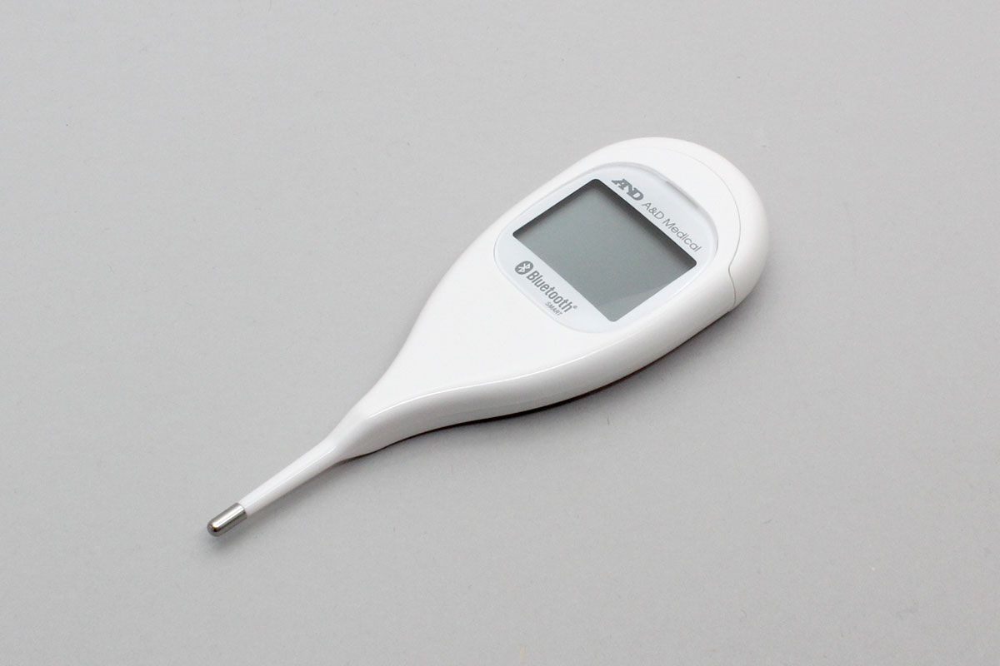

# UT201BLE
This is a thermometer from A&D Corporation.



## isDevice(peripheral)

Judges whether or not it is UT201BLE based on the advertised information received by the BLE.
```javascript
// Javascript Example
await obniz.ble.initWait();
const UT201BLE = Obniz.getPartsClass("UT201BLE");
obniz.ble.scan.onfind = async (peripheral) => {
  if (UT201BLE.isDevice(peripheral)) {
    console.log("device find");
  }
};
await obniz.ble.scan.startWait();

```

## new UT201BLE(peripheral)

Instances are created based on the advertised information received by the BLE.

```javascript
// Javascript Example
await obniz.ble.initWait();
const UT201BLE = Obniz.getPartsClass("UT201BLE");
obniz.ble.scan.onfind = async (peripheral) => {
  if (UT201BLE.isDevice(peripheral) ) {
    console.log("device find");
    const device = new UT201BLE(peripheral);
  }
};
await obniz.ble.scan.startWait();

```


## [await]getDataWait()

Connects to the device and collects data in batches.
The only data that can be retrieved is the data that the device has not yet sent.

After the data is sent, the connection to the device is automatically terminated.


```javascript
// Javascript Example
await obniz.ble.initWait();
const UT201BLE = Obniz.getPartsClass("UT201BLE");
obniz.ble.scan.onfind = async (peripheral) => {
  if (UT201BLE.isDevice(peripheral)) {
    console.log("find");
    const device = new UT201BLE(peripheral);
    
    const data = await device.getDataWait();
    
    console.log(data);
    // {
    //     fahrenheit?: number;
    //     celsius?: number;
    //     date?: {
    //       year: number;
    //       month: number;
    //       day: number;
    //       hour: number;
    //       minute: number;
    //       second: number;
    //     };
    //     temperatureType?: string;
    //   }
  }
};
await obniz.ble.scan.startWait();

```


Output format is here. temperature data is in fahrenheit or celsius.

```json
{
  fahrenheit?: number;
  celsius?: number;
  date?: {
    year: number;
    month: number;
    day: number;
    hour: number;
    minute: number;
    second: number;
  };
  temperatureType?: string;
}
```
