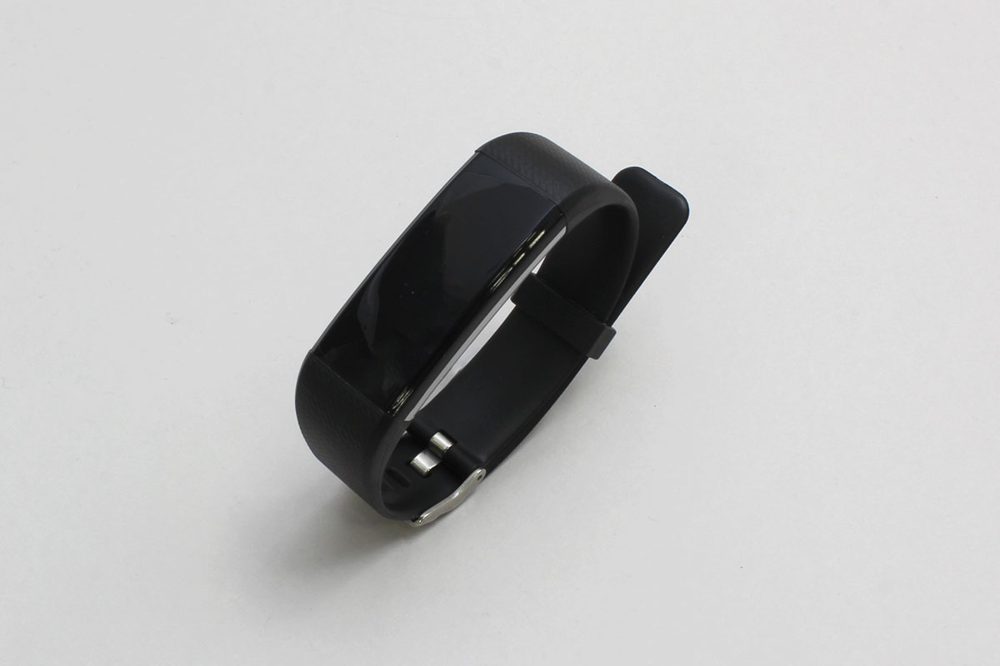

# VitalBand

BLE通信のウェアラブル型活動量計バンド



## データ取得

- SN: シリアルナンバー
- heart_rate: 心拍数
- body_temp: 体温 (℃)
- blood_pleasure_high: 血圧 高
- blood_pleasure_low: 血圧 低
- Sp02: saturation of percutaneous oxygen (経皮的酸素飽和度)
- battery: バッテリー (%)
- steps: 歩数

<br>

```javascript
// Javascript Example
const VitalBand = Obniz.getPartsClass('VitalBand');
await obniz.ble.initWait();
obniz.ble.scan.onfind = (peripheral) => {
    if (VitalBand.isDevice(peripheral)) {
        const device = new VitalBand(peripheral);
        const data = device.getData();
        console.log(data);
    }
};
await obniz.ble.scan.startWait(null, { duplicate: true, duration: null });
```

<br>
