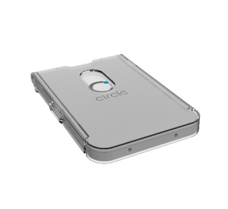

# CIR415A

BLE connectable NFC reader writer.




## isDevice(BleRemotePeripheral)

Returns true if a device was found.

```javascript
// Javascript Example
const CIR415A = Obniz.getPartsClass('cir415a');
await obniz.ble.initWait();
obniz.ble.scan.start(null, { duplicate: true, duration: null });
obniz.ble.scan.onfind = (p) => {
    if (CIR415A.isDevice(p)) {
        console.log("found");
    }
};
```


## new CIR415A(BleRemotePeripheral)

Create an instance based on the information received by BLE.

```javascript
// Javascript Example
const CIR415A = Obniz.getPartsClass('cir415a');
await obniz.ble.initWait();
obniz.ble.scan.start();
obniz.ble.scan.onfind = async (peripheral) => {
  if (CIR415A.isDevice(peripheral) ) {
    console.log("found");
    const device = new CIR415A(peripheral);
  }
};
```

## [await]connectWait()

Connect with CIR415A.

```javascript
// Javascript Example
const CIR415A = Obniz.getPartsClass('cir415a');
await obniz.ble.initWait();
obniz.ble.scan.start();
obniz.ble.scan.onfind = async (peripheral) => {
  if (CIR415A.isDevice(peripheral) ) {
    console.log("found");
    const device = new CIR415A(peripheral);
    device.ondisconnect = (reason) => {
      console.log(reason)
    }
    await device.connectWait();
  }
};
```

## [await]disconnectWait()

Disconnect from CIR415A.

```javascript
// Javascript Example
const CIR415A = Obniz.getPartsClass('cir415a');
await obniz.ble.initWait();
obniz.ble.scan.start();
obniz.ble.scan.onfind = async (peripheral) => {
  if (CIR415A.isDevice(peripheral) ) {
    console.log("found");
    const device = new CIR415A(peripheral);
    await device.connectWait();
    await device.disconnectWait();
  }
};
```

## setMasterKey(key)

You can change the master key.
Do this before executing the `` connectWait`` function.

```javascript
// Javascript Example
const CIR415A = Obniz.getPartsClass('cir415a');
await obniz.ble.initWait();
obniz.ble.scan.start();
obniz.ble.scan.onfind = async (peripheral) => {
  if (CIR415A.isDevice(peripheral) ) {
    console.log("found");
    const device = new CIR415A(peripheral);
    device.setMasterKey([0, 1, 2, 3, 4, 5, 6, 7, 8, 9, 10, 11, 12, 13, 14, 15]);
    await device.connectWait();
  }
};
```

## setAutoPollingWait(enable)

The NFC reader will automatically check if there is a change in the card status.
Go after the `` onAuthenticated`` callback function has been executed.

```javascript
// Javascript Example
const CIR415A = Obniz.getPartsClass('cir415a');
await obniz.ble.initWait();
obniz.ble.scan.start();
obniz.ble.scan.onfind = async (peripheral) => {
  if (CIR415A.isDevice(peripheral) ) {
    console.log("found");
    const device = new CIR415A(peripheral);
    device.onAuthenticated = async () => {
        console.log("onAuthenticated");
        await device.setAutoPollingWait(true);
    };
    await device.connectWait();
  }
};
```

## writeADPU(data)

You can execute commands on the card.
Go after the `` onAuthenticated`` callback function has been executed.

```javascript
// Javascript Example
const CIR415A = Obniz.getPartsClass('cir415a');
await obniz.ble.initWait();
obniz.ble.scan.start();
obniz.ble.scan.onfind = async (peripheral) => {
  if (CIR415A.isDevice(peripheral) ) {
    console.log("found");
    const device = new CIR415A(peripheral);
    device.onAuthenticated = async () => {
        console.log("onAuthenticated");
        await device.setAutoPollingWait(true);
        await device.writeADPU([ 0xff, 0xca, 0x00, 0x00, 0x00]); // send apdu idm
    };
    await device.connectWait();
  }
};
```

## write(data)

You can execute commands for CIR415A.
Go after the `` onAuthenticated`` callback function has been executed.

```javascript
// Javascript Example
const CIR415A = Obniz.getPartsClass('cir415a');
await obniz.ble.initWait();
obniz.ble.scan.start();
obniz.ble.scan.onfind = async (peripheral) => {
  if (CIR415A.isDevice(peripheral) ) {
    console.log("found");
    const device = new CIR415A(peripheral);
    device.onAuthenticated = async () => {
        console.log("onAuthenticated");
        await device.write([0x6b, 0x00, 0x05, 0x00, 0x00, 0x00, 0x00, 0xe0, 0x00, 0x00, 0x40, 0x01]);
    };
    await device.connectWait();
  }
};
```

## onNotify =  function (data){}

When data is received, return the data in a callback function.

```javascript
// Javascript Example
const CIR415A = Obniz.getPartsClass('cir415a');
await obniz.ble.initWait();
obniz.ble.scan.start();
obniz.ble.scan.onfind = async (peripheral) => {
  if (CIR415A.isDevice(peripheral) ) {
    console.log("found");
    const device = new CIR415A(peripheral);
    device.onNotify = async (data) => {
        console.log("onNotify");
        console.log(data);
        if (data[0] === 0x80) {
            //console.log("apdu event");
            console.log(data);
            let array = data.slice(7, 15);
            if(array.length !== 8){
                return ;
            }
            let idm = "";
            for (let i = 0; i < array.length - 1; i++) {
                idm +=  ("0" + array[i].toString(16)).slice(-2) + ":";
            }
            idm +=  ("0" + array[7].toString(16)).slice(-2);
            console.log(`Suica idm : ${idm}`);
        }
    };
    await device.connectWait();
  }
};
```


## onAuthenticated =  function (){}

When authentication is completed, it returns in the callback function.。

```javascript
// Javascript Example
const CIR415A = Obniz.getPartsClass('cir415a');
await obniz.ble.initWait();
obniz.ble.scan.start();
obniz.ble.scan.onfind = async (peripheral) => {
  if (CIR415A.isDevice(peripheral) ) {
    console.log("found");
    const device = new CIR415A(peripheral);
    device.onAuthenticated = async () => {
        console.log("onAuthenticated");
        await device.setAutoPollingWait(true);
    };
    await device.connectWait();
  }
};
```

## onCardTouch =  function (touch){}

When the card is touched, it returns in the callback function. Returns true when touched.

```javascript
// Javascript Example
const CIR415A = Obniz.getPartsClass('cir415a');
await obniz.ble.initWait();
obniz.ble.scan.start();
obniz.ble.scan.onfind = async (peripheral) => {
  if (CIR415A.isDevice(peripheral) ) {
    console.log("found");
    const device = new CIR415A(peripheral);
    device.onAuthenticated = async () => {
        console.log("onAuthenticated");
        await device.setAutoPollingWait(true);
    };
    device.onNotify = async (data) => {
        console.log("onNotify");
        console.log(data);
        if (data[0] === 0x80) {
            //console.log("apdu event");
            console.log(data);
            let array = data.slice(7, 15);
            if(array.length !== 8){
                return ;
            }
            let idm = "";
            for (let i = 0; i < array.length - 1; i++) {
                idm +=  ("0" + array[i].toString(16)).slice(-2) + ":";
            }
            idm +=  ("0" + array[7].toString(16)).slice(-2);
            console.log(`Suica idm : ${idm}`);
        }
    };
    device.onCardTouch = async (touch) =>{
        if(touch){
            console.log("card touch");
            await device.writeADPU([ 0xff, 0xca, 0x00, 0x00, 0x00]); // send apdu idm
        }else{
            console.log("card not touch");
        }
    };
    await device.connectWait();
  }
};
```
