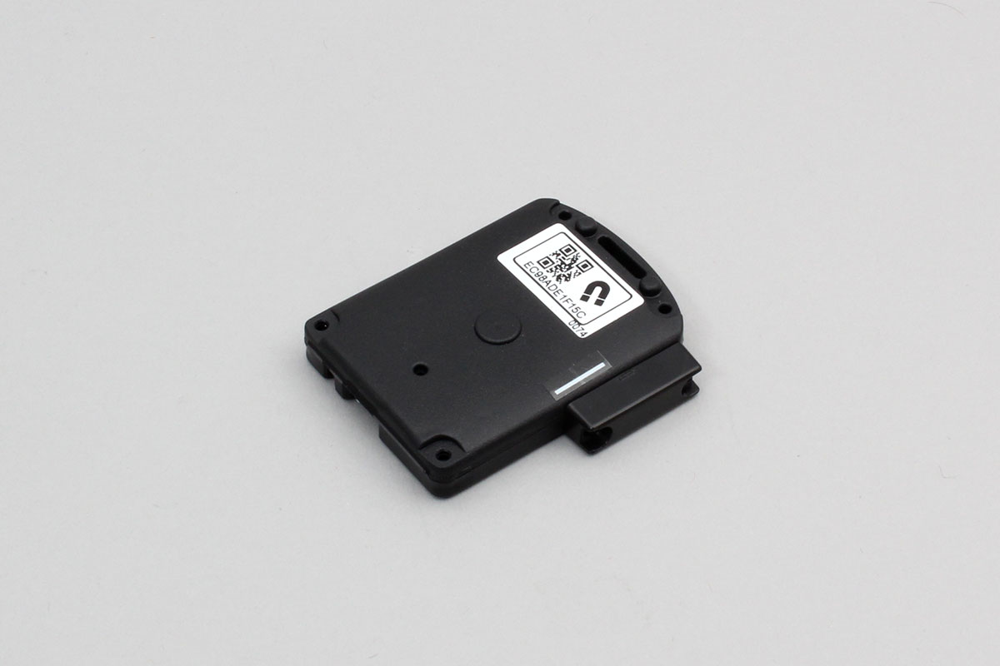

# iBS01H

Magnet sensor by INGICS.

Support device

- iBS01H




## getPartsClass(name)

```javascript
// Javascript Example
const IBS01H = Obniz.getPartsClass('iBS01H');
```

## isDevice(BleRemotePeripheral)

Returns true if a device was found.

```javascript
// Javascript Example
let IBS01H = Obniz.getPartsClass('iBS01H');
await obniz.ble.initWait();
obniz.ble.scan.onfind = (p) => {
    if (IBS01H.isDevice(p)) {
        let data = IBS01H.getData(p);
        console.log(data);
    }
};
await obniz.ble.scan.startWait(null, { duplicate: true, duration: null });
```

## getData(BleRemotePeripheral)

Returns device information if found. Returns Null if not found.

- battery : Battery voltage
- button : True when button is pressed
- hall_sensor : True when the magnet approaches


```javascript
// Javascript Example
let IBS01H = Obniz.getPartsClass('iBS01H');
await obniz.ble.initWait();
obniz.ble.scan.onfind = (p) => {
    if (IBS01H.isDevice(p)) {
        let data = IBS01H.getData(p);
        console.log(data);
    }
};
await obniz.ble.scan.startWait(null, { duplicate: true, duration: null });
```
