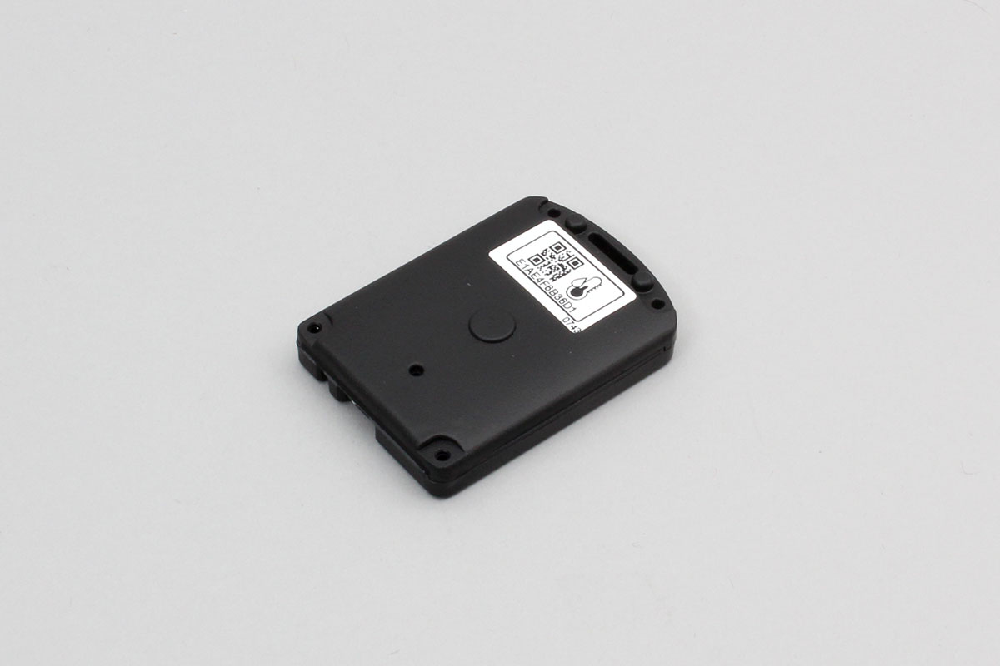

# iBS01T
temperature & humidity made by INGICS.

Support device

- iBS01T




## getPartsClass(name)

```javascript
// Javascript Example
const IBS01T = Obniz.getPartsClass('iBS01T');
```

## isDevice(BleRemotePeripheral)

Returns true if a device was found.

```javascript
// Javascript Example
let IBS01T = Obniz.getPartsClass('iBS01T');
await obniz.ble.initWait();
obniz.ble.scan.onfind = (p) => {
    if (IBS01T.isDevice(p)) {
        let data = IBS01T.getData(p);
        console.log(data);
    }
};
await obniz.ble.scan.startWait(null, { duplicate: true, duration: null });
```

## getData(BleRemotePeripheral)

Returns device information if found. Returns Null if not found.

- battery : Battery voltage
- button : True when button is pressed
- moving : True when moving
- reed : True when reed bit 1
- temperature : temperature(℃)
- humidity : humidity (%)

```javascript
// Javascript Example
let IBS01T = Obniz.getPartsClass('iBS01T');
await obniz.ble.initWait();
obniz.ble.scan.onfind = (p) => {
    if (IBS01T.isDevice(p)) {
        let data = IBS01T.getData(p);
        console.log(data);
    }
};
await obniz.ble.scan.startWait(null, { duplicate: true, duration: null });
```
