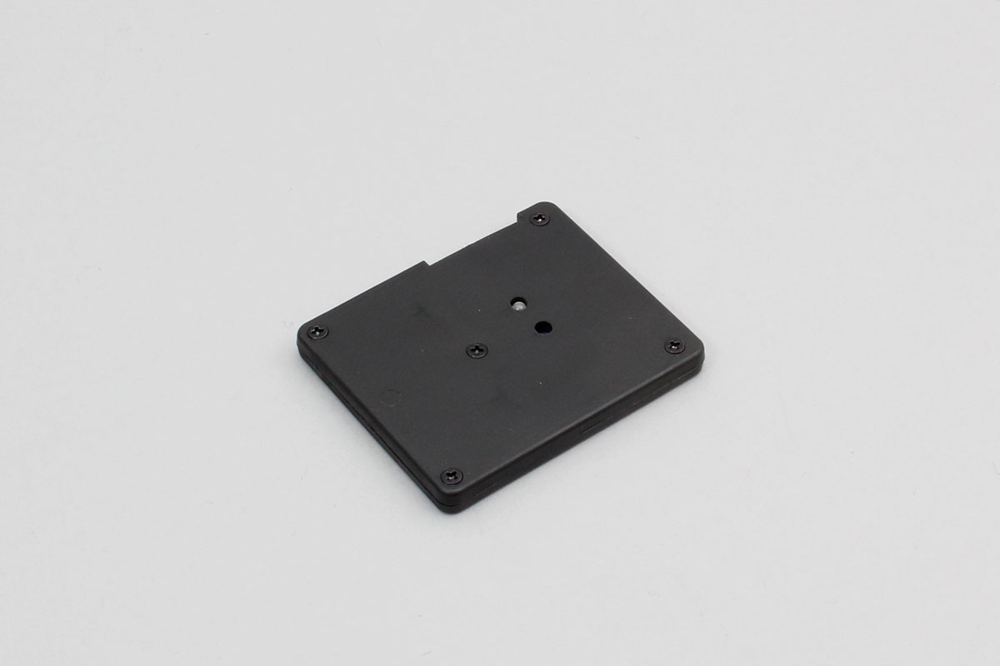

# iBS02IR

INGICS社製の近接センサーです。赤外線を利用し物体が近くにあるかどうかを検知します。

Support device

- iBS02IR




## getPartsClass(name)

```javascript
// Javascript Example
const IBS02 = Obniz.getPartsClass('iBS02IR');
```

## isDevice(BleRemotePeripheral)

デバイスを発見した場合、trueを返します。

```javascript
// Javascript Example
const IBS02 = Obniz.getPartsClass('iBS02IR');
await obniz.ble.initWait();
obniz.ble.scan.onfind = (p) => {
    if (IBS02.isDevice(p)) {
        let data = IBS02.getData(p);
        console.log(data);
    }
};
await obniz.ble.scan.startWait(null, { duplicate: true, duration: null });
```

## getData(BleRemotePeripheral)

発見した場合にデバイスの情報を返します。発見できなかった場合にはNullを返します。

- battery : 電池電圧
- event : センサーに反応があるときtrue

```javascript
// Javascript Example
const IBS02 = Obniz.getPartsClass('iBS02IR');
await obniz.ble.initWait();
obniz.ble.scan.onfind = (p) => {
    if (IBS02.isDevice(p)) {
        let data = IBS02.getData(p);
        console.log(data);
    }
};
await obniz.ble.scan.startWait(null, { duplicate: true, duration: null });
```


# iBS02IR
INGICS社製の温湿度センサーです。


## wired(obniz)

```javascript
// Javascript Example
let ibs02ir = obniz.wired('iBS02IR');
```

## scan()

iBS01Tを検索し、発見した場合、その情報をCallback関数で返します。

```javascript
// Javascript Example
let ibs02ir = obniz.wired('iBS02IR');
ibs02ir.onNotification = (data => {
            console.log(`battery ${data.battery}V event ${data.event} address ${data.address}`);
        });
ibs02ir.scan();
```

## onNotification = function(data){}

発見した場合にその情報をCallback関数で返します。

- battery : 電池電圧
- event : event
- address : モジュールアドレス

```javascript
// Javascript Example
let ibs02ir = obniz.wired('iBS02IR');
ibs02ir.onNotification = (data => {
            console.log(`battery ${data.battery}V event ${data.event} address ${data.address}`);
        });
ibs02ir.scan();
```


## onChangeMoving = function(moved){}

動きがあれば、コールバック関数で返します。

```javascript
// Javascript Example
let ibs02ir = obniz.wired('iBS02IR');
ibs02ir.onChangeMoving = (moved =>{
                console.log(`moving state ${moved}`);
            });
ibs02ir.scan();
```

## end()

スキャンを終了します。

```javascript
// Javascript Example
let ibs02ir = obniz.wired('iBS02IR');
ibs02ir.end();
```
