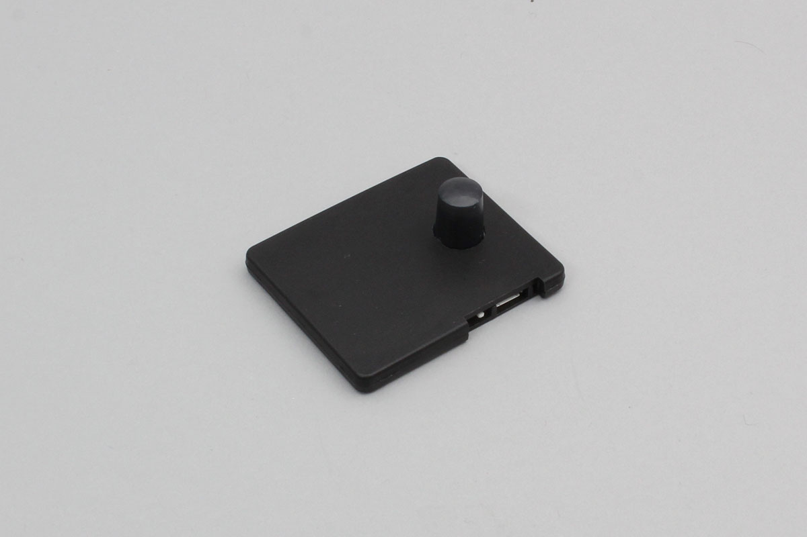

# iBS02PIR

INGICS社製の人感センサーです。

Support device

- iBS02PIR




## getPartsClass(name)

```javascript
// Javascript Example
const IBS02 = Obniz.getPartsClass('iBS02PIR');
```

## isDevice(BleRemotePeripheral)

デバイスを発見した場合、trueを返します。

```javascript
// Javascript Example
const IBS02 = Obniz.getPartsClass('iBS02PIR');
await obniz.ble.initWait();
obniz.ble.scan.onfind = (p) => {
    if (IBS02.isDevice(p)) {
        let data = IBS02.getData(p);
        console.log(data);
    }
};
await obniz.ble.scan.startWait(null, { duplicate: true, duration: null });
```

## getData(BleRemotePeripheral)

発見した場合にデバイスの情報を返します。発見できなかった場合にはNullを返します。

- battery : 電池電圧
- event : センサーに反応があるときtrue

```javascript
// Javascript Example
const IBS02 = Obniz.getPartsClass('iBS02PIR');
await obniz.ble.initWait();
obniz.ble.scan.onfind = (p) => {
    if (IBS02.isDevice(p)) {
        let data = IBS02.getData(p);
        console.log(data);
    }
};
await obniz.ble.scan.startWait(null, { duplicate: true, duration: null });
```
