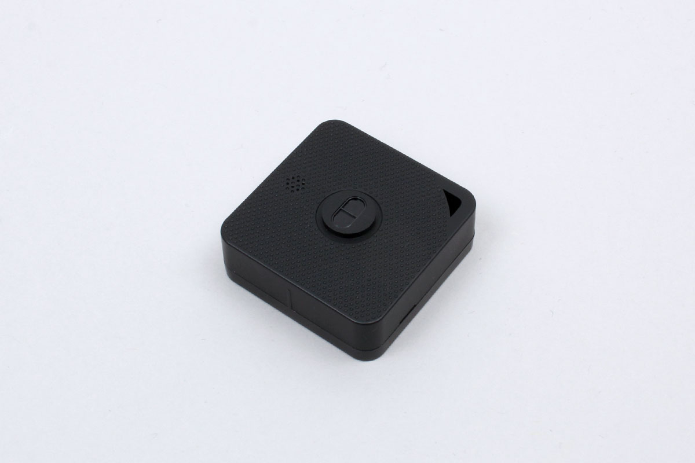

# iBS03R
distance sensor.





## getPartsClass(name)

```javascript
// Javascript Example
const IBS03R = Obniz.getPartsClass('iBS03R');
```

## isDevice(BleRemotePeripheral)

Returns true if a device was found.

```javascript
// Javascript Example
const IBS03R = Obniz.getPartsClass('iBS03R');
await obniz.ble.initWait();
obniz.ble.scan.onfind = (p) => {
    if (IBS03R.isDevice(p)) {
        let data = IBS03R.getData(p);
        console.log(data);
    }
};
await obniz.ble.scan.startWait(null, { duplicate: true, duration: null });
```

## getData(BleRemotePeripheral)

Returns device information if found. Returns Null if not found.

- battery : Battery voltage 
- distance: distance value;

```javascript
// Javascript Example
const IBS03R = Obniz.getPartsClass('iBS03R');
await obniz.ble.initWait();
obniz.ble.scan.onfind = (p) => {
    if (IBS03R.isDevice(p)) {
        let data = IBS03R.getData(p);
        console.log(data);
    }
};
await obniz.ble.scan.startWait(null, { duplicate: true, duration: null });
```
