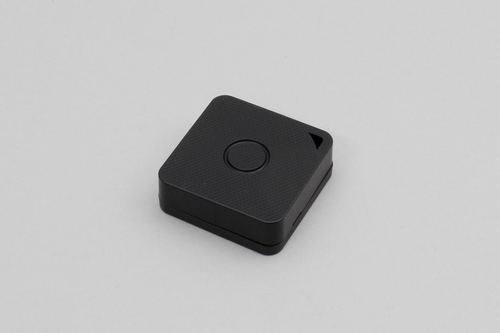

# iBS03T
temperature sensor made by INGICS.

Support device

- iBS03T




## getPartsClass(name)

```javascript
// Javascript Example
const IBS03 = Obniz.getPartsClass('iBS03T');
```

## isDevice(BleRemotePeripheral)

Returns true if a device was found.

```javascript
// Javascript Example
const IBS03 = Obniz.getPartsClass('iBS03T');
await obniz.ble.initWait();
obniz.ble.scan.onfind = (p) => {
    if (IBS03.isDevice(p)) {
        let data = IBS03.getData(p);
        console.log(data);
    }
};
await obniz.ble.scan.startWait(null, { duplicate: true, duration: null });
```

## getData(BleRemotePeripheral)

Returns device information if found. Returns Null if not found.

- battery : Battery voltage
- button : True when button is pressed
- moving : True when moving
- hall_sensor : True when the magnet approaches
- temperature : temperature(℃)


```javascript
// Javascript Example
const IBS03 = Obniz.getPartsClass('iBS03T');
await obniz.ble.initWait();
obniz.ble.scan.onfind = (p) => {
    if (IBS03.isDevice(p)) {
        let data = IBS03.getData(p);
        console.log(data);
    }
};
await obniz.ble.scan.startWait(null, { duplicate: true, duration: null });
```
