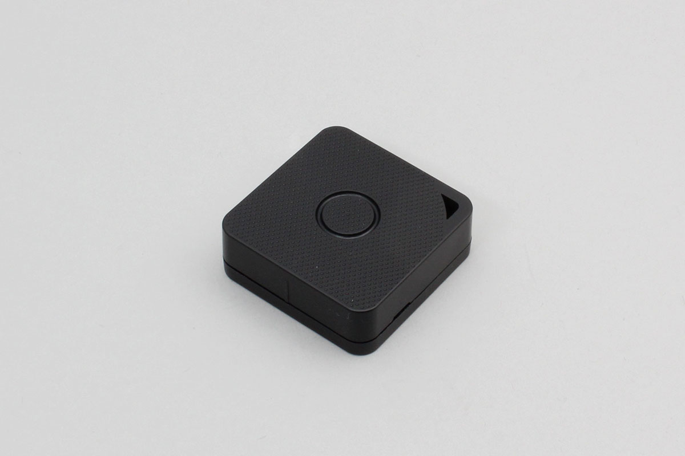

# iBS03 iBS04
INGICS社製のBLEタグです。

サポートデバイス

- iBS03(H) : Button, Magnet Event
- iBS04 : Button Event




## getPartsClass(name)

```javascript
// Javascript Example
const IBS03 = Obniz.getPartsClass('iBS03');
```

## isDevice(BleRemotePeripheral)

デバイスを発見した場合、trueを返します。

```javascript
// Javascript Example
const IBS03 = Obniz.getPartsClass('iBS03');
await obniz.ble.initWait();
obniz.ble.scan.start(null, { duplicate: true, duration: null });
obniz.ble.scan.onfind = (p) => {
    if (IBS03.isDevice(p)) {
        let data = IBS03.getData(p);
        console.log(data);
    }
};
```

## getData(BleRemotePeripheral)

発見した場合にデバイスの情報を返します。発見できなかった場合にはNullを返します。

- battery : 電池電圧
- button : ボタンを押すとtrue
- moving : 動くとtrue
- hall_sensor : 磁石が近づくとtrue

```javascript
// Javascript Example
const IBS03 = Obniz.getPartsClass('iBS03');
await obniz.ble.initWait();
obniz.ble.scan.start(null, { duplicate: true, duration: null });
obniz.ble.scan.onfind = (p) => {
    if (IBS03.isDevice(p)) {
        let data = IBS03.getData(p);
        console.log(data);
    }
};
```

