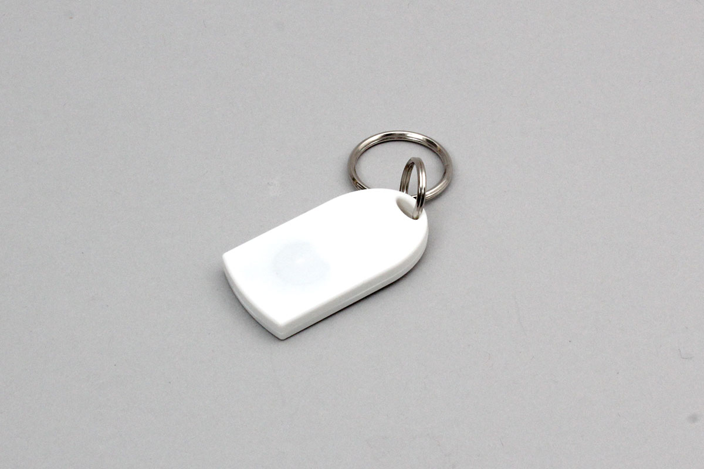

# iBS04i
beacon advertising device made by INGICS.

Support device

- iBS04i




## getPartsClass(name)

```javascript
// Javascript Example
const IBS04I = Obniz.getPartsClass('iBS04i');
```

## isDevice(BleRemotePeripheral)

Returns true if a device was found.

```javascript
// Javascript Example
const IBS04I = Obniz.getPartsClass('iBS04i');
await obniz.ble.initWait();
obniz.ble.scan.onfind = (p) => {
    if (IBS04I.isDevice(p)) {
        let data = IBS04I.getData(p);
        console.log(data);
    }
};
await obniz.ble.scan.startWait(null, { duplicate: true, duration: null });
```

## getData(BleRemotePeripheral)

Returns device information if found. Returns Null if not found.

- battery : Battery voltage
- button : Button pressed: true
- uuid : iBeacon　UUID
- major : iBeacon　major
- minor : iBeacon　minor
- power : iBeacon　power
- rssi :  Signal strength

```javascript
// Javascript Example
const IBS04I = Obniz.getPartsClass('iBS04i');
await obniz.ble.initWait();
obniz.ble.scan.onfind = (p) => {
    if (IBS04I.isDevice(p)) {
        let data = IBS04I.getData(p);
        console.log(data);
    }
};
await obniz.ble.scan.startWait(null, { duplicate: true, duration: null });
```
