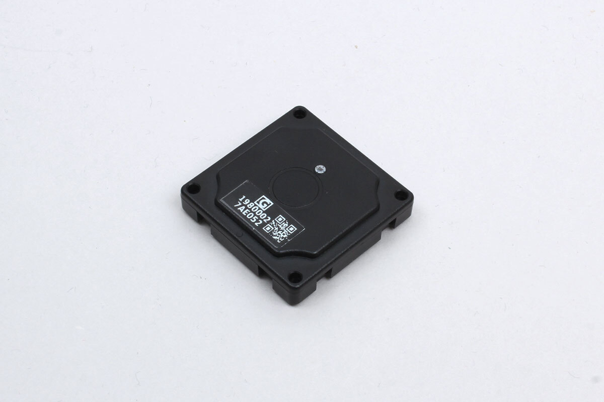

# iBS05G

INGICS社製の防水防塵、低電力のセンサー  
モノが動いたことを検知します。



## 対応モード

- ビーコンモード

## ビーコンデータ(getData())

- battery: 電池電圧
- moving: 動くとtrue

## 使用例

```javascript
// Javascript
const iBS05G = Obniz.getPartsClass('iBS05G');
await obniz.ble.initWait();
obniz.ble.scan.onfind = (peripheral) => {
  // 動作モードを取得、iBS05Gでないときはnullに
  const mode = iBS05G.getDeviceMode(peripheral);
  if (mode) {
    // インスタンスを生成
    const device = new iBS05G(peripheral, mode);
    // データを取得し、コンソールに出力
    console.log(device.getData());
  }
};
await obniz.ble.scan.startWait(null, { duplicate: true, duration: null });
```
