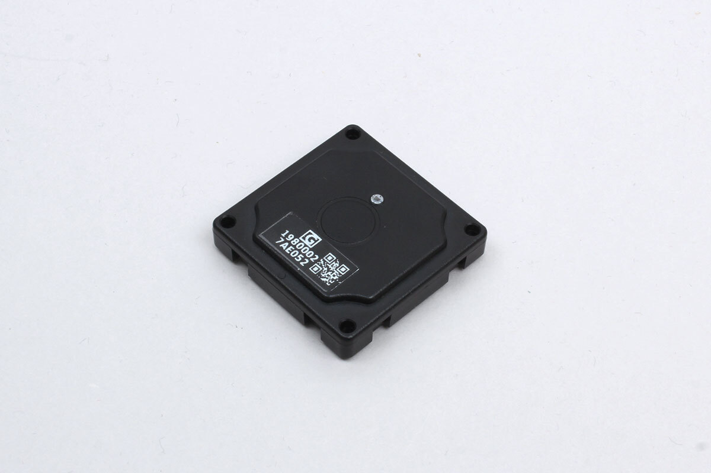

# iBS05G

Moving sensor by INGICS



## Available modes

- Beacon mode

## Beacon data (getData())

- battery: Battery voltage
- moving: True when moved

## Use case

```javascript
// Javascript
const iBS05G = Obniz.getPartsClass('iBS05G');
await obniz.ble.initWait();
obniz.ble.scan.onfind = (peripheral) => {
  // Get operation mode, it becomes null when not iBS05G
  const mode = iBS05G.getDeviceMode(peripheral);
  if (mode) {
    // Generate an instance
    const device = new iBS05G(peripheral, mode);
    // Get data and output to the console
    console.log(device.getData());
  }
};
await obniz.ble.scan.startWait(null, { duplicate: true, duration: null });
```
