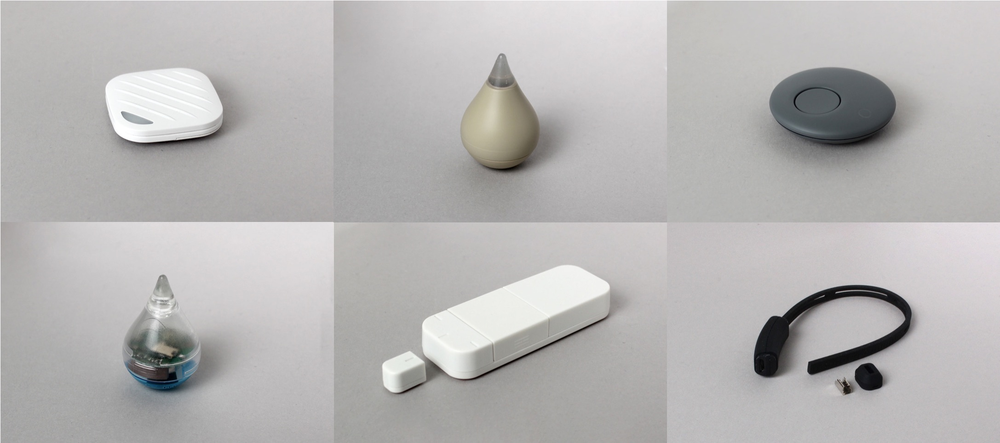

# Linking Devices

Common Parts Library for [Linking Devices](https://ssl.braveridge.com/store/html/products/list.php?category_id=7)



This is forked project.
Thanks for [https://github.com/futomi/node-linking](https://github.com/futomi/node-linking)

## Usage

See how to use this library on [https://github.com/futomi/node-linking](https://github.com/futomi/node-linking).

## Example Programs

Tomoru [https://codesandbox.io/s/linking-tomoru-l89lu](https://codesandbox.io/s/linking-tomoru-l89lu)

Sizuku 6x [https://codesandbox.io/s/linking-acc-406cj](https://codesandbox.io/s/linking-acc-406cj)

## wired(obniz)

Registrate lining parent class to an obniz device to search and connect linking devices.

```javascript
// Javascript Example
const linking = obniz.wired("Linking");
await linking.init();
const device_list = await linking.discover({
  duration: 5000,
  nameFilter: "Tomoru"
});
if (device_list.length == 0) {
  console.log("not found");
  return;
}
device = device_list[0];
device.onconnectprogress = obj => {
  console.log(obj);
};
await device.connect();
await device.services.led.turnOn("Red", "Pattern1");
```


## pairing

Pairing with the device is automatic when needed.
If you want to save your pairing key, use onPairedCallback


```javascript
// Javascript Example
const linking = obniz.wired("Linking");
await linking.init();
const device_list = await linking.discover({
  duration: 5000,
  nameFilter: "Tomoru"
});
if (device_list.length == 0) {
  console.log("not found");
  return;
}
device = device_list[0];
device.onconnectprogress = obj => {
  console.log(obj);
};
await device.connect({
  pairingOption : {
    onPairedCallback : (keys) =>{
       //store key 
       console.log(keys);
    }
  }
});
```


If you want to use a pairing key after the second connection, please specify a key when you connect.

```javascript
// Javascript Example
const keys = "xxxxxx"; //stored keys

const linking = obniz.wired("Linking");
await linking.init();
const device_list = await linking.discover({
  duration: 5000,
  nameFilter: "Tomoru"
});
if (device_list.length == 0) {
  console.log("not found");
  return;
}
device = device_list[0];
device.onconnectprogress = obj => {
  console.log(obj);
};
await device.connect({
  pairingOption : {
    keys : keys  
  }
});
```
