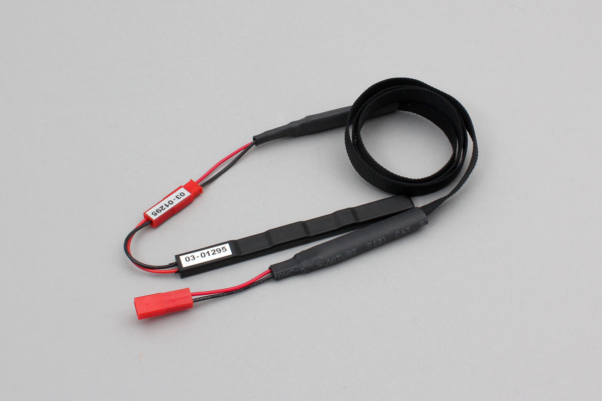

# SCBTGAAAC

This is a leak sensor manufactured by ABLIC.




## getPartsClass(name)

```javascript
// Javascript Example
const DEVICE = Obniz.getPartsClass('SCBTGAAAC');
```

## isDevice(BleRemotePeripheral)

Returns true if a device was found.

```javascript
// Javascript Example
const DEVICE = Obniz.getPartsClass('SCBTGAAAC');
await obniz.ble.initWait();
obniz.ble.scan.onfind = (p) => {
    if (DEVICE.isDevice(p)) {
        let name = DEVICE.getData(p);
        console.log(name);
    }
};
await obniz.ble.scan.startWait(null, { duplicate: true, duration: null });
```

## getData(BleRemotePeripheral)

Returns the name of the device if found. Returns Null if not found.

```javascript
// Javascript Example
const DEVICE = Obniz.getPartsClass('SCBTGAAAC');
await obniz.ble.initWait();
obniz.ble.scan.onfind = (p) => {
    if (DEVICE.isDevice(p)) {
        let name = DEVICE.getData(p);
        console.log(name);
    }
};
await obniz.ble.scan.startWait(null, { duplicate: true, duration: null });
```
