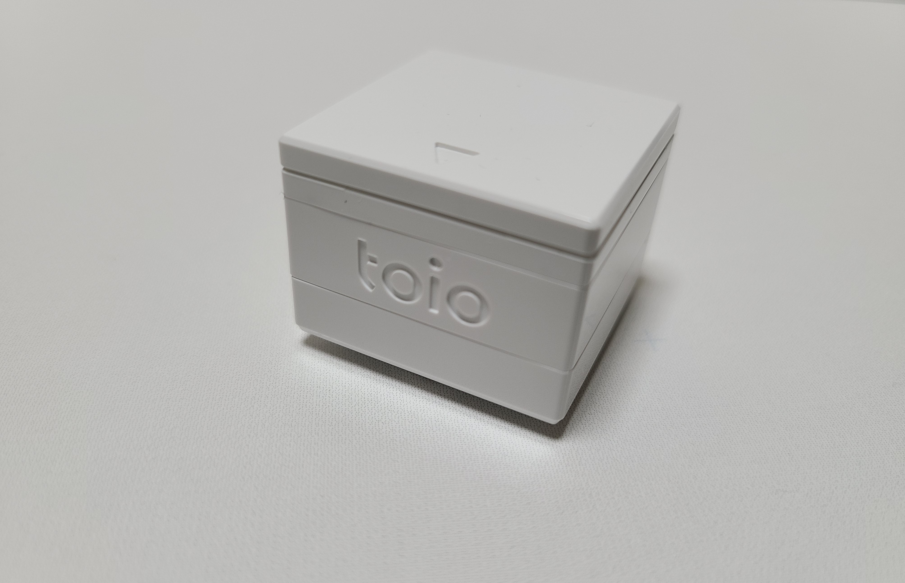

# toio Core Cube
The toio core cube is a product of Sony Interactive Entertainment Inc.
It is a simple 32 mm wide robot.

(This parts library is an unofficial implementation based on the technical specification of toio, which is published in the following link.)

https://toio.github.io/toio-spec/

# License
See [LICENSE.txt](LICENSE.txt).




## isDevice(peripheral)

Check whether it is a toio core cube based on the advertised information received by the BLE.

```javascript
// Javascript Example
await obniz.ble.initWait();
const Toio_CoreCube = Obniz.getPartsClass("toio_CoreCube");
obniz.ble.scan.onfind = async (peripheral) => {
  if (Toio_CoreCube.isDevice(peripheral)) {
    console.log("find");
  }
};
await obniz.ble.scan.startWait();

```

## new Toio_CoreCube(peripheral)

Create an instance based on the advertisement information.

```javascript
// Javascript Example

await obniz.ble.initWait();
const Toio_CoreCube = Obniz.getPartsClass("toio_CoreCube");
obniz.ble.scan.onfind = async (peripheral) => {
  if (Toio_CoreCube.isDevice(peripheral)) {
    console.log("find");
    const device = new Toio_CoreCube(peripheral);
  }
};
await obniz.ble.scan.startWait();

```


## [await]connectWait()

Connect to device.


```javascript
// Javascript Example

await obniz.ble.initWait();
const Toio_CoreCube = Obniz.getPartsClass("toio_CoreCube");
obniz.ble.scan.onfind = async (peripheral) => {
  if (Toio_CoreCube.isDevice(peripheral)) {
    console.log("find");
    const device = new Toio_CoreCube(peripheral);
    device.ondisconnect = (reason) => {
      console.log(reason)
    }
    await device.connectWait();
    console.log("connected");
  }
};
await obniz.ble.scan.startWait();

```


## [await]disconnectWait()

Disconnect from device.

```javascript
// Javascript Example
await obniz.ble.initWait();
const Toio_CoreCube = Obniz.getPartsClass("toio_CoreCube");
obniz.ble.scan.onfind = async (peripheral) => {
  if (Toio_CoreCube.isDevice(peripheral)) {
    console.log("find");
    const device = new Toio_CoreCube(peripheral);
    await device.connectWait();
    console.log("connected");
    await device.disconnectWait();
    console.log("disconnected");
  }
};
await obniz.ble.scan.startWait();

```


## [await]getPositionWait
Get the absolute location (the toio ID) where the toio core cube currently locates.

More detail is [here](https://toio.github.io/toio-spec/docs/ble_id).


```javascript
// Javascript Example
await obniz.ble.initWait();
const Toio_CoreCube = Obniz.getPartsClass("toio_CoreCube");
obniz.ble.scan.onfind = async (peripheral) => {
  if (Toio_CoreCube.isDevice(peripheral)) {
    console.log("find");
    const device = new Toio_CoreCube(peripheral);
    await device.connectWait();
    console.log("connected");
    const data = await device.getPositionWait();
    console.log(data);
  }
};
await obniz.ble.scan.startWait();

```

Output example is this. 

```

{
  posX : 709, // X-coordinate value of the cube's center (toio ID).
  posY : 383,  // Y-coordinate value of the cube's center (toio ID).
  angle : 306,// Angle value of the cube.
  posSensorX : 700, // X-coordinate value of the cube's read sensor (toio ID).
  posSensorY : 386, // Y-coordinate value of the cube's read sensor (toio ID).
  posSensorAngle : 306,// Angle value of the cube's read sensor. 
}
```


## [await]getMotionWait
Get the toio core cube state information detected by 6-axis detection system.

More detail is [here](https://toio.github.io/toio-spec/docs/ble_sensor#%E8%AA%AD%E3%81%BF%E5%87%BA%E3%81%97%E6%93%8D%E4%BD%9C
).

```javascript
// Javascript Example
await obniz.ble.initWait();
const Toio_CoreCube = Obniz.getPartsClass("toio_CoreCube");
obniz.ble.scan.onfind = async (peripheral) => {
  if (Toio_CoreCube.isDevice(peripheral)) {
    console.log("find");
    const device = new Toio_CoreCube(peripheral);
    await device.connectWait();
    console.log("connected");
    const data = await device.getMotionWait();
    console.log(data);
  }
};
await obniz.ble.scan.startWait();

```

Output example is this. 
This atitude is based on [here](https://toio.github.io/toio-spec/docs/ble_sensor#%E5%A7%BF%E5%8B%A2%E6%A4%9C%E5%87%BA).

```

{
  isHorizon : false, // Detects horizontal(true:Horizontal/false:Not horizontal).
  isCollision : false,  // Detects Collision(true:Collisioned/false:Not Collisioned).
  isDoubletap : false,// Detects double tap for cube(true:Double Taped/false:Not double tapped).
  atitude : 3, // Please see adove link.
}
```

## [await]getBatteryStateWait

Get cube's Battery level.
The remaining battery level is changed in 10 increments.


```javascript
// Javascript Example
await obniz.ble.initWait();
const Toio_CoreCube = Obniz.getPartsClass("toio_CoreCube");
obniz.ble.scan.onfind = async (peripheral) => {
  if (Toio_CoreCube.isDevice(peripheral)) {
    console.log("find");
    const device = new Toio_CoreCube(peripheral);
    await device.connectWait();
    console.log("connected");
    const batteryEquip = await device.getBatteryStateWait();
    console.log(batteryEquip);//0~100[%]
  }
};
await obniz.ble.scan.startWait();

```

## [await]getButtonStateWait
Get state button pressed.


```javascript
// Javascript Example
await obniz.ble.initWait();
const Toio_CoreCube = Obniz.getPartsClass("toio_CoreCube");
obniz.ble.scan.onfind = async (peripheral) => {
  if (Toio_CoreCube.isDevice(peripheral)) {
    console.log("find");
    const device = new Toio_CoreCube(peripheral);
    await device.connectWait();
    console.log("connected");
    const isButtonPush = await device.getButtonStateWait();
    console.log(isButtonPush);//true:Pressed/false:Not Pressed
  }
};
await obniz.ble.scan.startWait();

```

## [await]moveAroundWait(_leftWheelPower,_rightWheelPower)
Move the motor in the toio core cube independently of the Position ID.

In order from left to right of the argument, the output of left motor and
right motor, and values from -255 to 255 are accepted.

(A positive value moves forward and a negative value moves backward.
Also, if 0 is entered or no value is passed to the argument, the motor will be stationary).

```javascript
// Javascript Example
await obniz.ble.initWait();
const Toio_CoreCube = Obniz.getPartsClass("toio_CoreCube");
obniz.ble.scan.onfind = async (peripheral) => {
  if (Toio_CoreCube.isDevice(peripheral)) {
    console.log("find");
    const device = new Toio_CoreCube(peripheral);
    await device.connectWait();
    console.log("connected");
    await device.moveAroundWait(100, 255);
  }
};
await obniz.ble.scan.startWait();

```

## [await]movePositionWait(timeoutSec,moveType, maxWheelPower, wheelPowerType,targetPosX, targetPosY, targetAngle)
Move to the specified position ID.

The argument based on [here](https://toio.github.io/toio-spec/docs/ble_motor#%E7%9B%AE%E6%A8%99%E6%8C%87%E5%AE%9A%E4%BB%98%E3%81%8D%E3%83%A2%E3%83%BC%E3%82%BF%E3%83%BC%E5%88%B6%E5%BE%A1
).

Argument example is this. 

```

{
  timeoutSec:5, // Time to time out of control.
  moveType:0, // Type of movement.
  maxWheelPower:80, // Maximum power of the motor.
  wheelPowerType:0, // Type of motor speed fluctuation.
  targetPosX:700, // X-coordinate value of the target point (toio ID).
  targetPosY:386, // Y-coordinate value of the target point (toio ID).
  targetAngle:90, // Angle Value of the target point (toio ID).
}
```


```javascript
// Javascript Example
await obniz.ble.initWait();
const Toio_CoreCube = Obniz.getPartsClass("toio_CoreCube");
obniz.ble.scan.onfind = async (peripheral) => {
  if (Toio_CoreCube.isDevice(peripheral)) {
    console.log("find");
    const device = new Toio_CoreCube(peripheral);
    await device.connectWait();
    console.log("connected");
    await device.movePositionWait(5, 0, 80, 0, 700, 386, 90);
  }
};
await obniz.ble.scan.startWait();

```

"toio" is a registered trademark or trademark of Sony Interactive Entertainment Inc.
