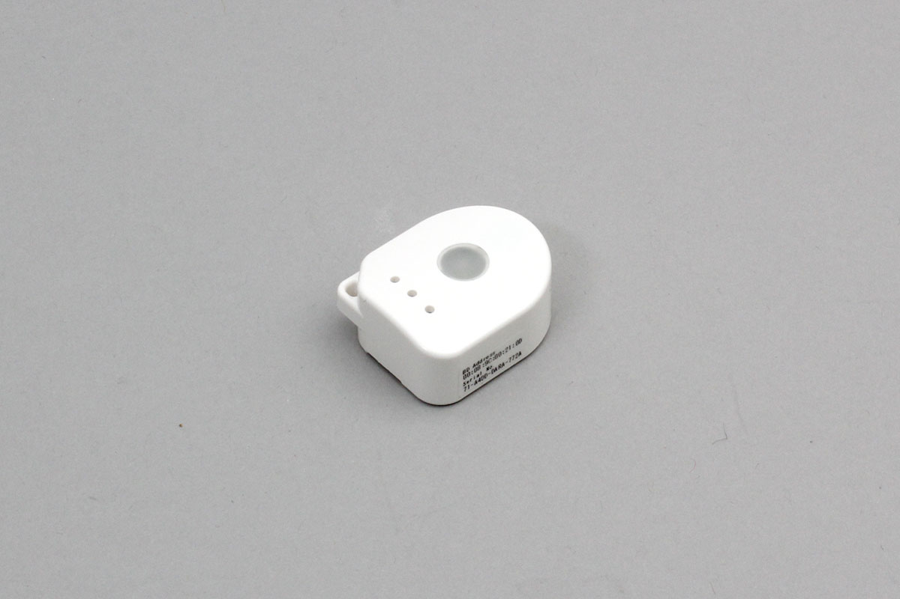

# μPRISM

This is a very small IoT sensor module manufactured by Elex Industrial Co., Ltd.


- Temperature
- Humidity
- Air Pressure
- Acceleration
- Compass
- UV
- Brightness



## isDevice(peripheral)

Judge whether it is μPRISM based on the advertisement information received by BLE

```javascript
// Javascript Example
await obniz.ble.initWait();
const U_PRISM = Obniz.getPartsClass("uPRISM");
obniz.ble.scan.onfind = async (peripheral) => {
  if (U_PRISM.isDevice(peripheral)) {
    console.log("device find");
  }
};
await obniz.ble.scan.startWait();

```

## new U_PRISM(peripheral)

Create an instance based on the advertisement information received by BLE.

```javascript
// Javascript Example
await obniz.ble.initWait();
const U_PRISM = Obniz.getPartsClass("uPRISM");
obniz.ble.scan.onfind = async (peripheral) => {
  if (U_PRISM.isDevice(peripheral) ) {
    console.log("device find");
    const device = new U_PRISM(peripheral);
  }
};
await obniz.ble.scan.startWait();

```


## [await]connectWait()

Connect to the device.

```javascript
// Javascript Example
await obniz.ble.initWait();
const U_PRISM = Obniz.getPartsClass("uPRISM");
obniz.ble.scan.onfind = async (peripheral) => {
  if (U_PRISM.isDevice(peripheral)) {
    console.log("find");
    const device = new U_PRISM(peripheral);
    device.ondisconnect = (reason) => {
      console.log(reason)
    }
    await device.connectWait();
    console.log("connected");
    device.onNotify = (r) => {
        console.log(
          `accel x:${r.acceleration.x} y:${r.acceleration.y} z:${r.acceleration.z}\n` +
            `geo x:${r.geomagnetic.x} y:${r.geomagnetic.y} z:${r.geomagnetic.z}\n` +
            `temp:${r.temperature}℃ humid:${r.humidity}% light:${r.ambient_light}lx pressure:${r.pressure}Pa UV index:${r.uvi} index:${r.index}\n` +
            `date ${r.time.year}/${r.time.month}/${r.time.day} ${r.time.hour}:${r.time.minute}:${r.time.second}:${r.time.micro_second}`,
        );
    };
    device.startNotifyWait();
  }
};
await obniz.ble.scan.startWait();

```


## [await]disconnectWait()

Disconnect from sensor

```javascript
// Javascript Example
await obniz.ble.initWait();
const U_PRISM = Obniz.getPartsClass("uPRISM");
obniz.ble.scan.onfind = async (peripheral) => {
  if (U_PRISM.isDevice(peripheral) ) {
    console.log("find");
    const device = new U_PRISM(peripheral);
    await device.connectWait();
    console.log("connected");
    await device.disconnectWait();
    console.log("disconnected");
  }
};
await obniz.ble.scan.startWait();

```


## onNotify =  function (data){}

When data is received, return the data in a callback function.

Called every time data comes from the device after starting `` startNotifyWait () ``.

```javascript
// Javascript Example
await obniz.ble.initWait();
const U_PRISM = Obniz.getPartsClass("uPRISM");
obniz.ble.scan.onfind = async (peripheral) => {
  if (U_PRISM.isDevice(peripheral)) {
    console.log("find");
    const device = new U_PRISM(peripheral);
    await device.connectWait();
    console.log("connected");
    device.onNotify = (r) => {
        console.log(
          `accel x:${r.acceleration.x} y:${r.acceleration.y} z:${r.acceleration.z}\n` +
            `geo x:${r.geomagnetic.x} y:${r.geomagnetic.y} z:${r.geomagnetic.z}\n` +
            `temp:${r.temperature}℃ humid:${r.humidity}% light:${r.ambient_light}lx pressure:${r.pressure}Pa UV index:${r.uvi} index:${r.index}\n` +
            `date ${r.time.year}/${r.time.month}/${r.time.day} ${r.time.hour}:${r.time.minute}:${r.time.second}:${r.time.micro_second}`,
        );
    };
    device.startNotifyWait();
  }
};
await obniz.ble.scan.startWait();
```


## startNotifyWait()

Instructs to start sending sensor data.

```javascript
// Javascript Example
await obniz.ble.initWait();
const U_PRISM = Obniz.getPartsClass("uPRISM");
obniz.ble.scan.onfind = async (peripheral) => {
  if (U_PRISM.isDevice(peripheral)) {
    console.log("find");
    const device = new U_PRISM(peripheral);
    await device.connectWait();
    console.log("connected");
    device.onNotify = (r) => {
        console.log(
          `accel x:${r.acceleration.x} y:${r.acceleration.y} z:${r.acceleration.z}\n` +
            `geo x:${r.geomagnetic.x} y:${r.geomagnetic.y} z:${r.geomagnetic.z}\n` +
            `temp:${r.temperature}℃ humid:${r.humidity}% light:${r.ambient_light}lx pressure:${r.pressure}Pa UV index:${r.uvi} index:${r.index}\n` +
            `date ${r.time.year}/${r.time.month}/${r.time.day} ${r.time.hour}:${r.time.minute}:${r.time.second}:${r.time.micro_second}`,
        );
    };
    device.startNotifyWait();
  }
};
await obniz.ble.scan.startWait();
```

