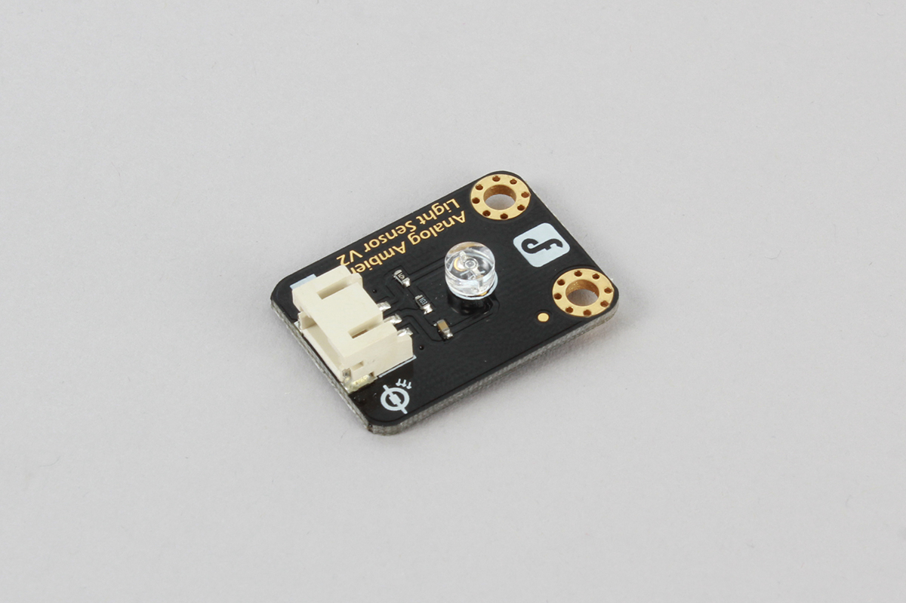

# PT550

Ambient light sensor.

Below image is DFROBOT's module using PT550.



## wired(obniz, { signal[, vcc, gnd]});

name | type | required | default | description
--- | --- | --- | --- | ---
signal | `number(obniz Board io)` | yes |  &nbsp; | output pin. (blue connector of DFROBOT's module)
vcc | `number(obniz Board io)` | no |  &nbsp; | vcc (red connector of DFROBOT's module)
gnd | `number(obniz Board io)` | no |  &nbsp; | gnd (black connector of DFROBOT's module)

PT550 is a photo transistor. Output current of signal change regarding brightness by supplying vcc,gnd.
It can be read by using resistors.
DFROBOT's module already has resistors so can be connect and read easily.

```Javascript
// Javascript Example
var pt550 = obniz.wired("PT550", {gnd:0, vcc:1, signal:2});
pt550.onchange = function(voltage) {
  console.log(voltage);
}
```

## onchange = function(voltage)

Change callback of brightness change.
It's voltage range is gnd to vcc.
Voltage will increase by brightness.

```Javascript
// Javascript Example
var pt550 = obniz.wired("PT550", {gnd:0, vcc:1, signal:2});
pt550.onchange = function(voltage) {
  console.log(voltage);
}
```

## [await] getWait()

Read voltage at onece.

```Javascript
// Javascript Example
var pt550 = obniz.wired("PT550", {gnd:0, vcc:1, signal:2});
const voltage = await pt550.getWait();
console.log(voltage);
```