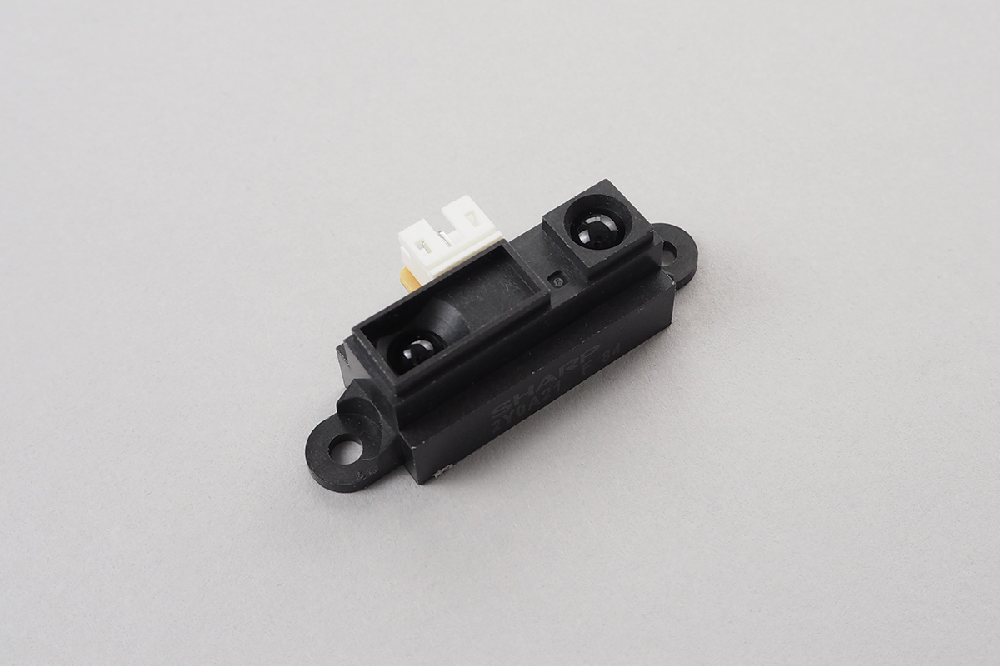

# Grove_DistanceSensor
Infrared Distance Measurement Unit.
This unit output voltage regarding measured distance.




## wired(obniz, {[signal, vcc, gnd, grove]})

connect to the obniz device.  
yellow, red and black wires correspond to signal, vcc and gnd respectively.  

name | type | required | default | description
--- | --- | --- | --- | ---
vcc | `number(obniz Board io)` | no |  &nbsp; | Power Supply
gnd | `number(obniz Board io)` | no |  &nbsp; | Power Supply
signal | `number(obniz Board io)` | no |  &nbsp; | signal output pin
grove | `object` | no | &nbsp;  | grove interface object if a device has

```javascript
// Javascript Example
let sensor = obniz.wired("Grove_DistanceSensor", {vcc:0, gnd:1, signal:2});
```

If the device has a grove interface, it can be connected with just the parameter {grove: obniz.grove0}.
```javascript
// Javascript Example
let sensor = obniz.wired("Grove_DistanceSensor", {grove: obniz.grove0});
```

## start(callback(distance))
measure distance continurously.
Callback will be called when distance changed.
default return unit is "mm". change by calling .unit()
```javascript
// Javascript Example
let sensor = obniz.wired("Grove_DistanceSensor", {grove: obniz.grove0});
sensor.start(function( distance ){
  console.log("distance " + distance + " mm")
})
```

## [await] getWait()

Measure distance once.

```javascript
// Javascript Example
let sensor = obniz.wired("Grove_DistanceSensor", {grove: obniz.grove0});

while (1) {
  var val = await sensor.getWait();
  console.log("distance " + val);
  await obniz.wait(1000);
}
    
```
    
## unit(unit)
change unit

1. "mm"(default)
2. "inch"

are available

```javascript
// Javascript Example
let sensor = obniz.wired("Grove_DistanceSensor", {grove: obniz.grove0});
sensor.unit("inch")
sensor.start(function( distance ){
  console.log("distance " + distance + " inch")
})
```

