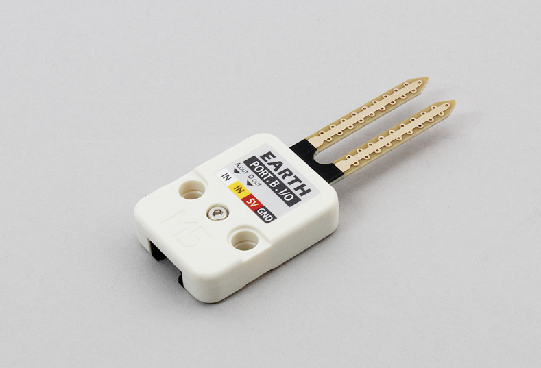

# Soil Moisture Sensor - EARTH



M5STACK用土壌湿度センサEARTHユニットです。土壌の湿度を取得できます。  
アナログ・デジタルの出力を持っています。

## wired(obniz, { [aout, dout, vcc, gnd, grove] })
デバイスにEARTHユニットをつなぎます。

name | type | required | default | description
--- | --- | --- | --- | ---
vcc | `number(obniz Board io)` | no |  &nbsp; | モジュールの場合はvcc, 単体の場合はHに接続します。別の電源につないでいる場合は指定する必要はありません。
gnd | `number(obniz Board io)` | no |  &nbsp; | モジュールの場合はgnd, 単体の場合はHに接続します。別の電源につないでいる場合は指定する必要はありません。
dout | `number(obniz Board io)` | no |  &nbsp; | デジタル出力です。
aout | `number(obniz Board io)` | no | &nbsp;  | アナログ出力です。
grove | `object` | no | &nbsp;  | 接続するデバイスにgroveがある場合に利用できます

白線、黄線、赤線、黒線がそれぞれaout、dout、vcc、gndに対応しています。

```javascript
obniz.onconnect = async function() {
  var earth = obniz.wired("Grove_EARTH", {aout: 0, dout: 1, vcc: 2, gnd: 3});
  earth.onchange = (val) => {
    console.log(val)
  }
}
```
  
groveを持つデバイスでは、パラメータに{grove: obniz.grove0}を指定することで接続できます。
```javascript
var obniz = new Obniz.M5StickC("OBNIZ_ID_HERE");
obniz.onconnect = async function() {
  var earth = obniz.wired("Grove_EARTH", { grove: obniz.grove0 });
  earth.onchange = (val) => {
    console.log(val)
  }
}
```

## onchange = function(value)
EARTHユニットのアナログ出力の値に変化があった場合にcallback関数を呼び出します。

値はアナログ出力の電圧となります。
乾いているほど電源(vcc)電圧に近く、水に触れるほど電圧は下がっていきます。

```javascript
var obniz = new Obniz.M5StickC("OBNIZ_ID_HERE");
obniz.onconnect = async function() {
  var earth = obniz.wired("Grove_EARTH", { grove: obniz.grove0 });
  earth.onchange = (val) => {
    console.log(val)
  }
}
```


## [await] getAnalogHumidityWait()
EARTHユニットのアナログ出力を読み取って返します。

値はアナログ出力の電圧となります。
乾いているほど電源(vcc)電圧に近く、水に触れるほど電圧は下がっていきます。

```javascript
// Javascript Example
var sensor = obniz.wired("Grove_EARTH", { grove: obniz.grove0 });
var value = await sensor.getAnalogHumidityWait();
console.log('Humidity Level:' + value);
```


## [await] getDigitalHumidityWait()
EARTHユニットのデジタル出力を読み取って返します。

```javascript
// Javascript Example
var sensor = obniz.wired("Grove_EARTH", { grove: obnizStick.grove0 });
var value = await sensor.getDigitalHumidityWait();
if (value) {
    console.log('Humidity level is toohigh!');
}
```
