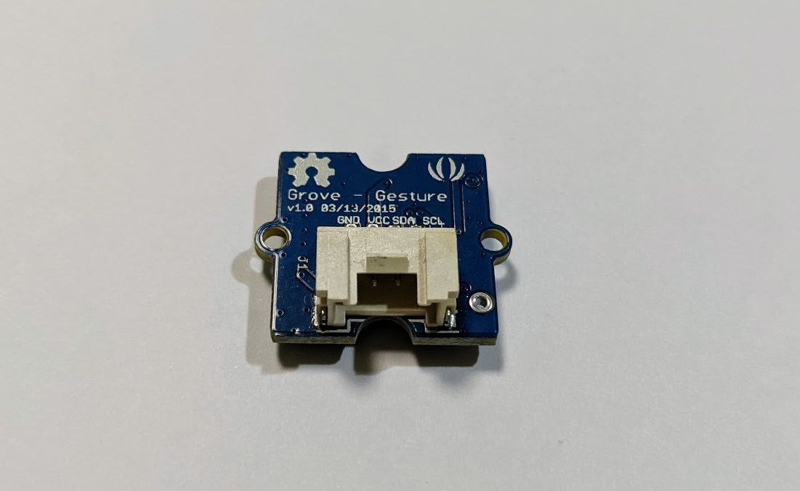
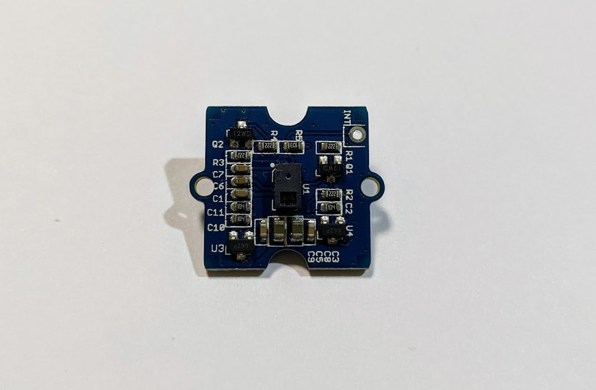

# Grove_GestureSensor

Grove AJ7620U2搭載ジェスチャーモジュール [Grove \- Gesture V1\.0](https://wiki.seeedstudio.com/Grove-Gesture_v1.0/) から様々なジェスチャを取得します。



## wired(scl, sda {, vcc, gnd, grove})

obniz BoardにGroveジェスチャーモジュールを接続します。
次のように接続を行います。

| grove | cable | obniz |
|:--:|:--:|:--:|
| scl | - | scl |
| sda | - | sda |
| vcc | - | vcc |
| gnd | - | gnd |


```javascript
// Javascript Example
var gestureSensor = obniz.wired("Grove_GestureSensor", { gnd:0 , vcc:1 , sda:2 , scl:3 });
```
  
groveを持つデバイスでは、パラメータに{grove: obniz.grove0}を指定することで接続できます。
```javascript
// Javascript Example
var gestureSensor = obniz.wired("Grove_GestureSensor", { grove: obniz.grove0 });
```

## onchange = function(value)

ジェスチャーの変化を文字列で受け取ります。

```javascript
var gestureSensor = obniz.wired("Grove_GestureSensor", { gnd:0 , vcc:1 , sda:2 , scl:3 });
gestureSensor.onchange = function(state){
  if (state == gestureSensor.GESTURE_RIGHT) {
    console.log("GESTURE_RIGHT");
  } else if (state == gestureSensor.GESTURE_LEFT) {
    console.log("GESTURE_LEFT");
  } else if (state == gestureSensor.GESTURE_UP) {
    console.log("GESTURE_UP");
  } else if (state == gestureSensor.GESTURE_DOWN) {
    console.log("GESTURE_DOWN");
  } else if (state == gestureSensor.GESTURE_FORWARD) {
    console.log("GESTURE_FORWARD");
  } else if (state == gestureSensor.GESTURE_BACKWARD) {
    console.log("GESTURE_BACKWARD");
  } else if (state == gestureSensor.GESTURE_CLOCKWISE) {
    console.log("GESTURE_CLOCKWISE");
  } else if (state == gestureSensor.GESTURE_COUNT_CLOCKWISE) {
    console.log("GESTURE_COUNT_CLOCKWISE");
  } 
}
```

## ジェスチャーについて

ジェスチャーを反応するのはこちらの面です。



動きの詳細は、[この動画](https://www.youtube.com/watch?v=e3nf-b4W6TY) が参考になります。