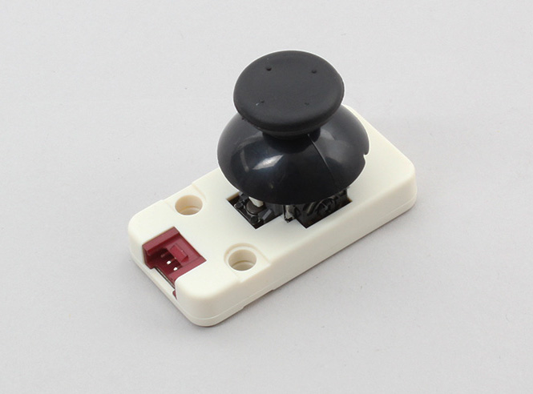

# Grove_JoyStick

X軸Y軸とプッシュスイッチをもつGrove対応のジョイスティックです。I2C通信を利用します。



## wired(obniz, {[scl, sda, vcc, gnd, grove]})
obnizデバイスと接続します。  
白線、黄線、赤線、黒線がそれぞれscl、sda、vcc、gndに対応します。  

name | type | required | default | description
--- | --- | --- | --- | ---
vcc | `number(obniz Board io)` | no |  &nbsp; | モジュールの場合はvcc, 単体の場合はHに接続します。別の電源につないでいる場合は指定する必要はありません。
gnd | `number(obniz Board io)` | no |  &nbsp; | モジュールの場合はgnd, 単体の場合はHに接続します。別の電源につないでいる場合は指定する必要はありません。
scl | `number(obniz Board io)` | no |  &nbsp; | I2Cのsclとなる端子です
sda | `number(obniz Board io)` | no | &nbsp;  | I2Cのsdaとなる端子です
i2c | `object` | no | &nbsp;  | obnizのi2cオブジェクトです
grove | `object` | no | &nbsp;  | 接続するデバイスにgroveがある場合に利用できます

```javascript
var joystick = obniz.wired("Grove_JoyStick", { scl:0, sda:1, vcc:2, gnd:3 });
```


groveを持つデバイスでは、パラメータに{grove: obniz.grove0}を指定することで接続できます。

```javascript
var obniz = new Obniz.M5StickC("OBNIZ_ID_HERE");
obniz.onconnect = async function() {
  var joystick = obniz.wired("Grove_JoyStick", { grove: obniz.grove0 });
}
```


## [await] isPressedWait()
ボタンが押されているかどうかを一度だけ取得します。  

```javascript
// JavaScript Examples
var joystick = obniz.wired("Grove_JoyStick", { grove: obniz.grove0 });
var isPressed = await joystick.isPressedWait();
if (isPressed) {
    console.log("Pressed!");
}
```


## [await] getXWait()
## [await] getYWait()

X、Yそれぞれの傾きを一度だけ取得します。

値は0~255の範囲となります。個体差などによりジョイスティックをすべて倒しても0や255まで届かないことがあります。

```javascript
// JavaScript Examples
var joystick = obniz.wired("Grove_JoyStick", { grove: obniz.grove0 });
while(true) {
  var x = await joystick.getXWait()
  var y = await joystick.getYWait()
  console.log(`${x}-${y}`);
  await obniz.wait(1);
}
```